<section data-background-image="assets/images/First_Slide.jpg">

<!-- .slide: data-state="no-header no-footer" -->

---

<h1 style="font-size: 1.8em; margin-block: 16% 10%;">ADVANCES IN NEURAL MUSIC PRODUCTION</h1>

    <strong>Fares Schulz</strong> 
    

        Researcher at the Audio Communication Group 
        Lead of Computer Music and Neural Audio Systems Research Team 
        Technische Universität Berlin
    

Notes:

- Hello everyone
- I will be presenting the history and latest advances of neural music production
- My name is Fares Schulz
- Researcher at Audio Communication Group at Technische Universität Berlin (like my colleague Annika)
- Lead of Computer Music and Neural Audio Systems Research Team

<!-- .slide: data-state="no-header" -->

---

## AI Overview

    

        

            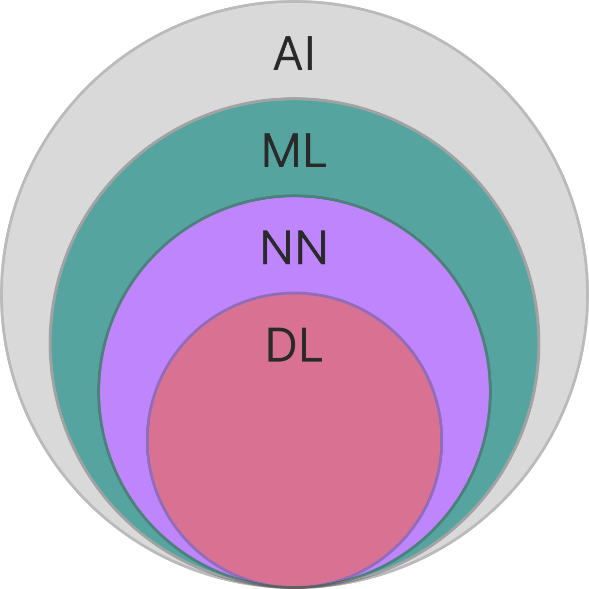
        

        

            <strong>Nested Relationship:</strong> AI ⊃ ML ⊃ NN ⊃ DL
        

    

    

        <h4>Hierarchical Relationship</h4>
        <ul>
            <li><strong>Artificial Intelligence (AI):</strong> Machines performing tasks requiring human-like intelligence</li>
            <li><strong>Machine Learning (ML):</strong> Algorithms that learn patterns from data without explicit programming</li>
            <li><strong>Neural Networks (NN):</strong> Interconnected nodes inspired by biological neurons</li>
            <li><strong>Deep Learning (DL):</strong> Uses multi-layered neural networks to model complex patterns</li>
        </ul>
    

  
<strong>Neural Music Production</strong> = Creative applications of neural networks in the music production domain

Notes:

- Let's start with a quick overview of artificial intelligence
- With AI, we refer to machines that can perform tasks that typically require human-like intelligence
- Machine learning is a subset of AI that focuses on algorithms that can learn patterns from data without being explicitly programmed
- Neural networks are a specific type of machine learning model inspired by the structure and function of biological neurons
- Deep learning is a subset of neural networks that uses multiple layers to model complex patterns in data

---

<h1 style="font-size: 1.5em; margin-block: 20% 10%;">HISTORY OF NEURAL MUSIC PRODUCTION</h1>

Notes:

- Before showing some of our research I will give an overview of the evolution of neural music production, highlighting key milestones and recent advancements
- As the field is extremely broad and fast-moving and I will only be able to cover a small part of it
- But I hope this will give you a good overview of the field and inspire you to explore further

---

## Early History of Neural Networks

    

        
Architectures & Layers

        
Evolution of network architectures and layer innovations

    

    

        

        

            

                
1957

                
Perceptron

                
Rosenblatt, F.

            

        

        

        

        

            

                
1979

                
Convolutional Networks

                
Fukushima, K.

            

        
 
        

        

        

            

                
1982

                
Recurrent Networks

                
Hopfield

            

        

        

        

        

            

                
1986

                
Backpropagation

                
Hinton et al.

            

        

        

        

        

            

                
2006

                
Deep Belief Networks

                
Hinton, G. et al.

            

        

        

        

        

            

                
2012

                
AlexNet

                
Krizhevsky et al.

            

        

        

    

    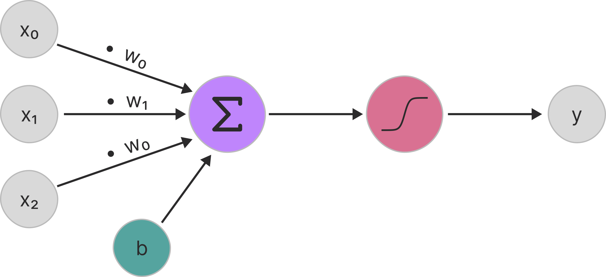

    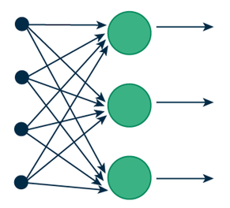
    

        https://www.cudocompute.com/topics/neural-networks/introduction-to-recurrent-neural-networks-rnns
    

    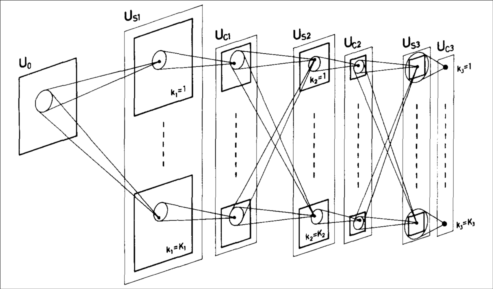
    

        Fukushima, K. (1980). Neocognitron: A self-organizing neural network model for a mechanism of pattern recognition unaffected by shift in position. Biological Cybernetics, 36(4), 193–202. https://doi.org/10.1007/BF00344251
    

    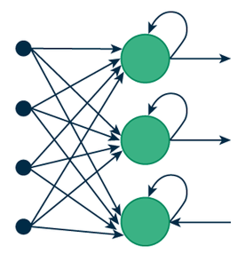
    

        https://www.cudocompute.com/topics/neural-networks/introduction-to-recurrent-neural-networks-rnns
    

    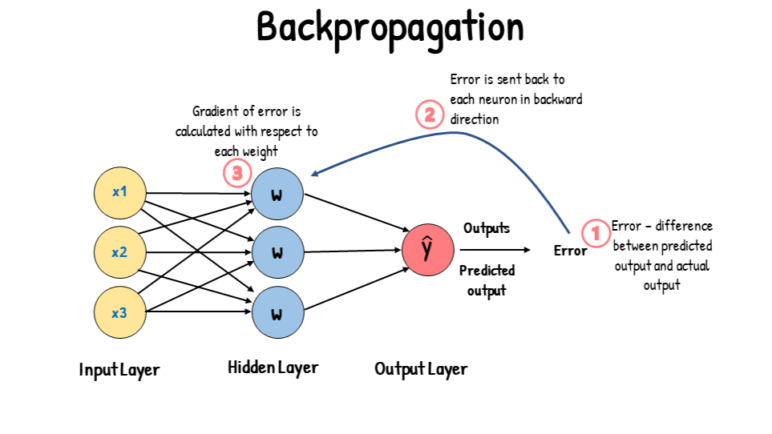
    

        https://www.linkedin.com/pulse/backpropagation-neural-networks-brain-behind-deep-learning-ali-v8fsf
    

    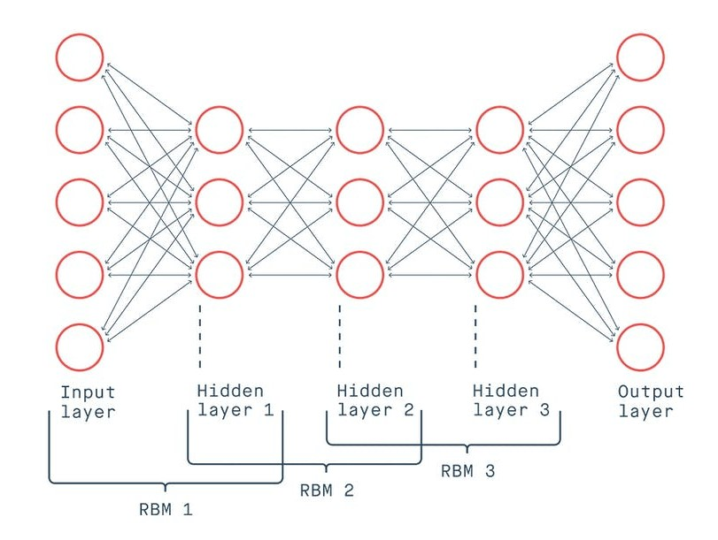
    

        https://www.analyticsvidhya.com/blog/2022/03/an-overview-of-deep-belief-network-dbn-in-deep-learning/
    

    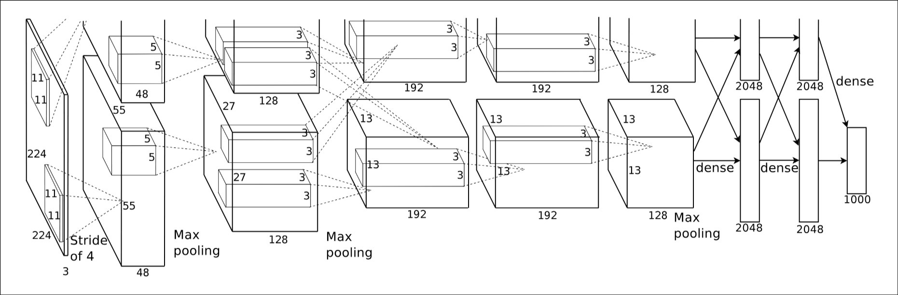
    

        Krizhevsky, A., Sutskever, I., & Hinton, G. E. (2012). Imagenet classification with deep convolutional neural networks. Advances in neural information processing systems, 25.
    

Notes:

- To understand the evolution of neural music production, I want to look first at the early history of neural networks
- In 1957, the perceptron was introduced by Frank Rosenblatt, marking the beginning of neural network research
- It was a simple model that could learn to classify inputs into different categories, by adjusting weights based on errors
- These errors were calculated from prelabeled data, which is called supervised learning
- Later, the multi-layer perceptron was developed, allowing for more complex representations of data
- In 1979, convolutional neural networks were introduced - replacing the multiplications with convolution operations
- And three years later - Hopfield networks were proposed, introducing recurrent connections - temporal dynamics
- Then the backpropagation algorithm enabled training of multi-layer networks - efficiently computing gradients
- Before the deep learning era, Deep Belief Networks were proposed as a way to pre-train deep networks layer by layer
- Finally, in 2012, AlexNet demonstrated the power of large deep convolutional networks on image classification tasks - marking the beginning of the deep learning revolution

---

## Early History of Neural Music Production

    

        

            
Key Milestones

            
Significant developments in neural music production

        

        

            

                

                

                    

                        
1957

                        
Perceptron

                    

                

                

                

                

                    

                        
1979

                        
CNN

                    

                
 
                

                

                

                    

                        
1982

                        
RNN

                    

                

                

                

                

                    

                        
1986

                        
Backpropagation

                    

                

                

                

                

                    

                        
2006

                        
Deep Belief Networks

                    

                

                

                

                

                    

                        
2012

                        
AlexNet

                    

                

                

            

            

                

                

                    

                        
1960

                        
LMS Filtering

                        
Widrow & Hoff

                    

                
 
                

                

                

                    

                        
1987

                        
NN for Phoneme Recognition

                        
Waibel et al.

                    

                

                

                

                

                    

                        
1989

                        
RNN for Symbolic Music Generation

                        
Todd

                    

                

                

                

                

                    

                        
1989

                        
Gradient Descent for Musical DSP

                        
Shynk & Moorer

                    

                

                

                

                

                    

                        
1997

                        
NN for Analog Effects Modeling

                        
Zhang & Duhamel

                    

                

                

                

                

                    

                        
1999

                        
NN for Piano Transcription

                        
Matija Marolt

                    

                

                

                

                

                    

                        
2009

                        
Audio features with DBN

                        
Lee et al.

                    

                

                

            

        

    

    <h3>Least Mean Square Filtering 
    (Widrow & Hoff)</h3>
    <ul>
        <li>Adaptive filtering algorithm for noise cancellation and echo suppression</li>
        <li>Uses <strong>stochastic gradient descent</strong> to minimize error between desired and actual output</li>
        <li>SGD = Foundation for later neural network training methods</li>
    </ul>

    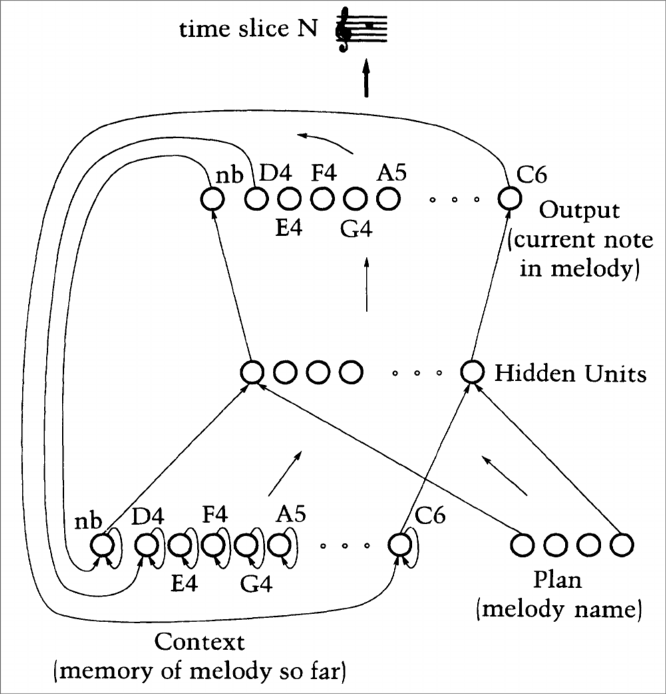
    

        Todd, P. M. (1989). A Connectionist Approach to Algorithmic Composition. Computer Music Journal, 13(4), 27–43.
    

    <h3>Unsupervised Audio Feature Learning with Deep Belief Networks 
    (Lee et al.)</h3>
    <ul>
        <li>Learning of audio features from unlabeled data - unsupervised learning</li>
        <li>Outperformed traditional hand-crafted features in many classification tasks</li>
    </ul>

Notes:

- Now let's look at some key milestones in neural music production during this early history
- Already in 1960, Widrow and Hoff introduced the Least Mean Square filtering algorithm
- Then 27 years later, neural networks were applied to phoneme recognition
- In 1989, Peter Todd used RNNs for symbolic music generation
- In the same year, there have been first attempts to use gradient descent for musical DSP
- In 1997, neural networks were used the first time for modeling analog effects
- Music transcription with neural networks dates back to 1999, with Matija Marolt's work on piano transcription
- Finally in 2009, Lee et al. demonstrated the effectiveness of deep belief networks for learning audio features with unsupervised learning - unlabeled data
- These features outperformed traditional hand-crafted features in many classification tasks

---

## Early History of Neural Music Production

    

        

            
Key Milestones

            
Significant developments in neural music production

        

        

            

                

                

                    

                        
1957

                        
Perceptron

                    

                

                

                

                

                    

                        
1979

                        
CNN

                    

                
 
                

                

                

                    

                        
1982

                        
RNN

                    

                

                

                

                

                    

                        
1986

                        
Backpropagation

                    

                

                

                

                

                    

                        
2006

                        
Deep Belief Networks

                    

                

                

                

                

                    

                        
2012

                        
AlexNet

                    

                

                

            

            

                

                

                    

                        
1960

                        
LMS Filtering

                        
Widrow & Hoff

                    

                

                

                

                

                    

                        
1987

                        
NN for Phoneme Recognition

                        
Waibel et al.

                    

                

                

                

                

                    

                        
1989

                        
RNN for Symbolic Music Generation

                        
Todd

                    

                

                

                

                

                    

                        
1989

                        
Gradient Descent for Musical DSP

                        
Shynk & Moorer

                    

                

                

                

                

                    

                        
1997

                        
NN for Analog Effects Modeling

                        
Zhang & Duhamel

                    

                

                

                

                

                    

                        
1999

                        
NN for Piano Transcription

                        
Matija Marolt

                    

                

                

                

                

                    

                        
2009

                        
Audio features with DBN

                        
Lee et al.

                    

                

                

            

        

    

    

        <h3>Gradient Descent Based Digital Signal Processing</h3>
        

            Use gradient descent to optimize parameters of digital signal processing algorithms for tasks like audio effects modeling and synthesis.
        

    

    

        <h3>Feature Extraction with Neural Networks</h3>
        

            Use neural networks to automatically learn and extract relevant features from audio data for tasks like classification, transcription, and analysis.
        

    

    

        <h3>Symbolic Music Generation with Neural Networks</h3>
        

            Use neural networks to generate symbolic music representations, such as music notation or MIDI sequences, for composition and arrangement tasks.
        

    

  
What about <strong>neural audio synthesis</strong>?

Notes:

- I would like to highlight that these early works can be categorised into three main areas.
- First, gradient descent based digital signal processing - using gradient descent to optimize parameters of DSP algorithms
- Second, feature extraction with neural networks - using neural networks to automatically learn and extract relevant features
- And the third category is symbolic music generation with neural networks
- But what about neural audio synthesis?

---

## The Deep Learning Era

    

        
Deep architectures

        
Deep architectures and generative models transforming AI capabilities

    

    

        

        

            

                
2013

                
Variational Autoencoders

                
Kingma & Welling

            

        

        

        

        

            

                
2014

                
Generative Adversarial Nets

                
Goodfellow et al.

            

        

        

        

        

            

                
2015

                
Diffusion

                
Sohl-Dickstein et al.

            

        

        

        

        

            

                
2017

                
Transformers

                
Vaswani et al.

            

        

        

        

        

            

                
2021

                
CLIP

                
Dosovitskiy & Radford

            

        

        

        

        

            

                
2022

                
Diffusion Transformer

                
Peebles & Xie

            

        

        

        

        

            

                
2023

                
Mamba

                
Gu & Dao

            

        

        

    

    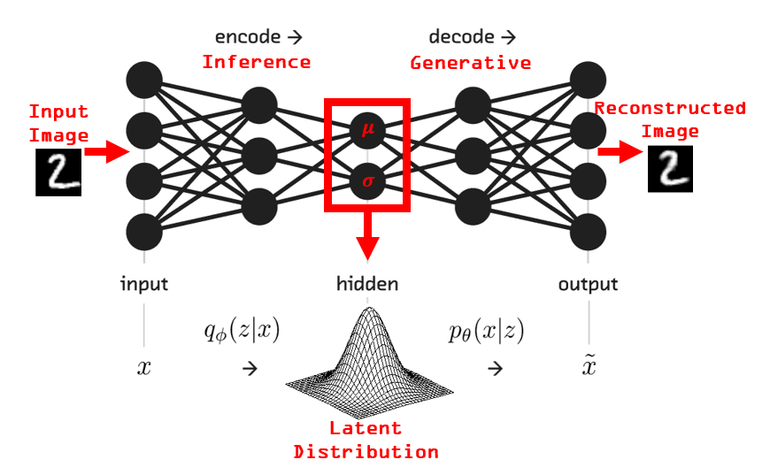
    

        https://theaisummer.com/Autoencoder/
    

    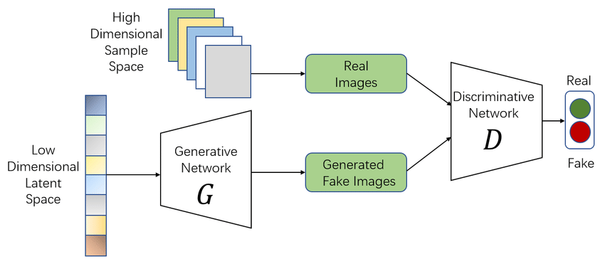
    

        https://www.linkedin.com/pulse/what-generative-adversarial-networks-gans-sushant-babbar-qpc9c
    

    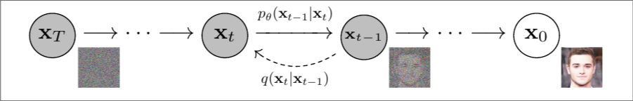
    

        Ho, J., Jain, A., & Abbeel, P. (2020). Denoising diffusion probabilistic models. Advances in neural information processing systems, 33, 6840-6851.
    

    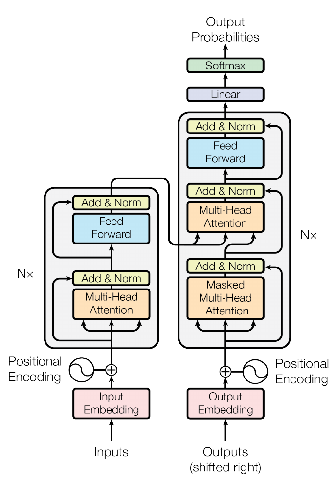
    

        Vaswani, A., Shazeer, N., Parmar, N., Uszkoreit, J., Jones, L., Gomez, A. N., ... & Polosukhin, I. (2017). Attention is all you need. Advances in neural information processing systems, 30.
    

    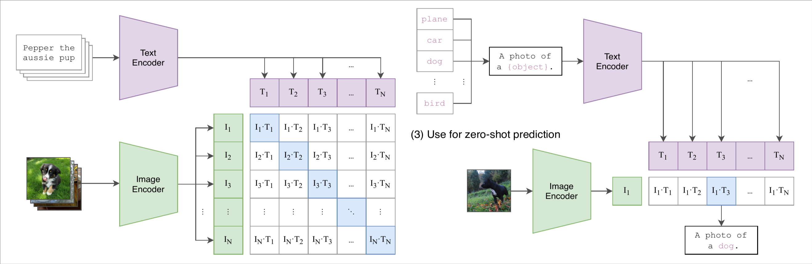
    

        Radford, A., Kim, J. W., Hallacy, C., Ramesh, A., Goh, G., Agarwal, S., ... & Sutskever, I. (2021). Learning transferable visual models from natural language supervision. In International conference on machine learning (pp. 8748-8763). PmLR.
    

    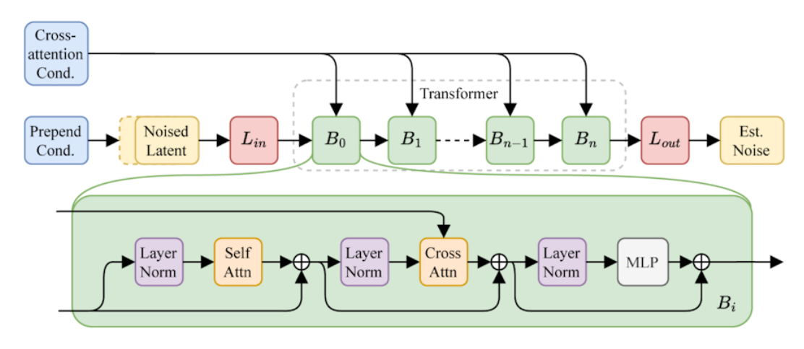
    

        https://digialps.com/stability-ais-new-open-source-ai-creation-stable-audio-2-0-takes-on-suno-ai/
    

Notes:

- Well, for neural audio synthesis we need the inventions of the deep learning era - first an overview of key milestones in deep learning in general
- In 2013, Variational Autoencoders were introduced - ability to generate new data points by sampling from a learned distribution - the latent distribution
- Learn in an unsupervised manner to encode input data into a compressed representation and then decode it back to the original input
- In 2014, Generative Adversarial Networks were proposed - two neural networks competing against each other
- In 2015, Diffusion models were introduced - iterative denoising process to generate high-quality samples
- The year 2017 was the year Transformers revolutionized sequence modeling with self-attention mechanisms
- In 2021, CLIP demonstrated the power of multi-modal learning by connecting images and text
- Two encoders that map images and text into a shared latent space - by using contrastive learning the images and text are mapped close to each other in the latent space
- It could for example classify images, without ever being trained on that specific task
- In 2022, Diffusion Transformers combined the strengths of diffusion models and transformers
- And finally in 2023, Mamba was introduced - a new architecture for sequence modeling

---

## Deep Neural Music Production

    

        

            
Key Milestones

            
Significant developments in deep neural music production

        

        

            

                

                

                    

                        
2013

                        
VAE

                        
Kingma & Welling

                    

                

                

                

                

                    

                        
2014

                        
GAN

                        
Goodfellow et al.

                    

                

                

                

                

                    

                        
2015

                        
Diffusion

                        
Sohl-Dickstein et al.

                    

                

                

                

                

                    

                        
2017

                        
Transformers

                        
Vaswani et al.

                    

                

                

                

                

                    

                        
2021

                        
CLIP

                        
Dosovitskiy & Radford

                    

                

                

                

                

                    

                        
2022

                        
Diffusion Transformer

                        
Peebles & Xie

                    

                

                

                

                

                    

                        
2023

                        
Mamba

                        
Gu & Dao

                    

                

                

            

            

                

                

                    

                        
2016

                        
WaveNet

                        
Oord et al.

                    

                

                

                

                

                    

                        
2017

                        
Neural Synthesis

                        
Engel et al.

                    

                

                

                

                

                    

                        
2019

                        
DDSP

                        
Engel et al.

                    

                

                

                

                

                    

                        
2020

                        
Automatic Mixing

                        
Steinmetz et al.

                    

                

                

                

                

                    

                        
2021

                        
RAVE

                        
Caillon & Esling

                    

                

                

                

                

                    

                        
2022

                        
CLAP

                        
Benjamin, et al.

                    

                

                

                

                

                    

                        
2024

                        
Stable Audio

                        
Evans et al.

                    

                

                

            

        

    

<!-- 

    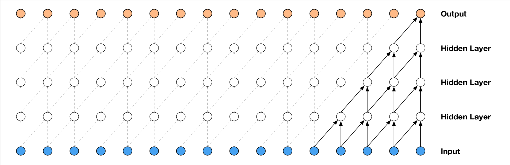
    

        Oord, A. van den, Dieleman, S., Zen, H., Simonyan, K., Vinyals, O., Graves, A., Kalchbrenner, N., Senior, A., & Kavukcuoglu, K. (2016). WaveNet: A Generative Model for Raw Audio (No. arXiv:1609.03499). https://doi.org/10.48550/arXiv.1609.03499
    

 -->

    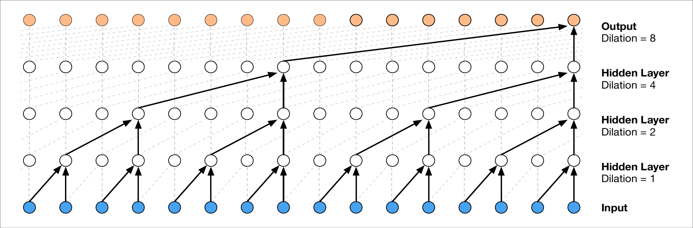
    

        Oord, A. van den, Dieleman, S., Zen, H., Simonyan, K., Vinyals, O., Graves, A., Kalchbrenner, N., Senior, A., & Kavukcuoglu, K. (2016). WaveNet: A Generative Model for Raw Audio (No. arXiv:1609.03499). https://doi.org/10.48550/arXiv.1609.03499
    

    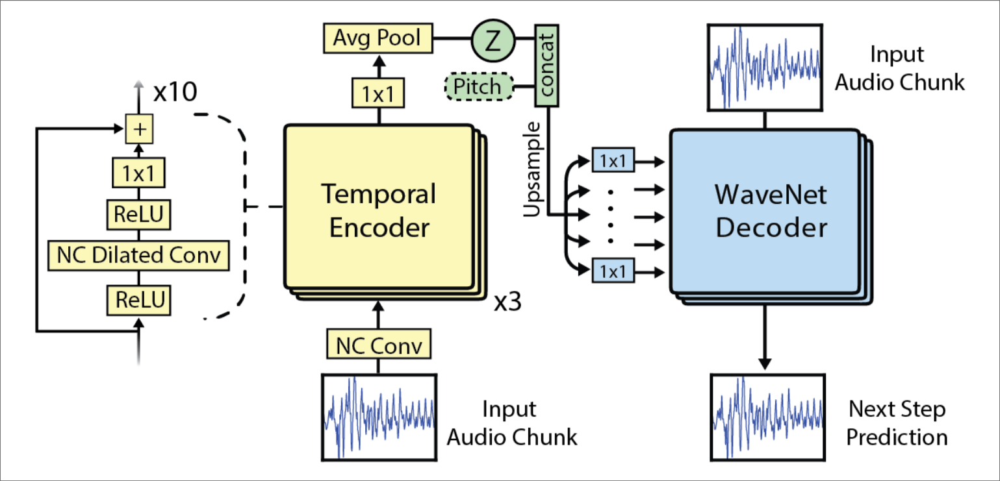
        

            Engel, J., Resnick, C., Roberts, A., Dieleman, S., Norouzi, M., Eck, D., & Simonyan, K. (2017, July). Neural audio synthesis of musical notes with wavenet autoencoders. In International conference on machine learning (pp. 1068-1077). PMLR.
        

    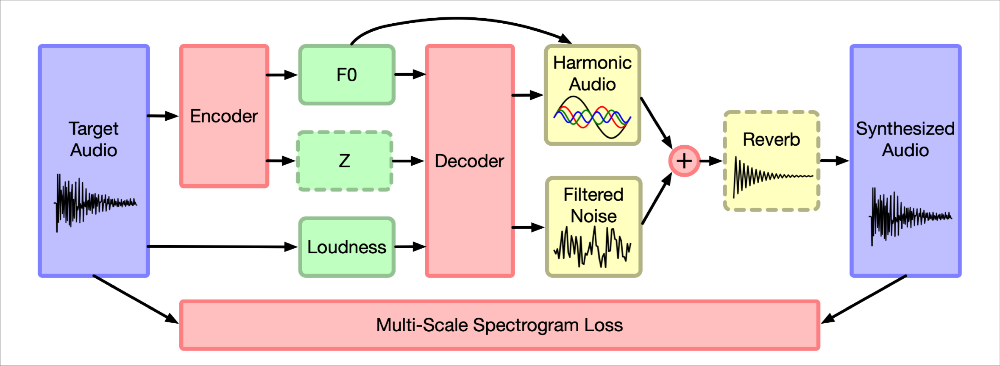
        

            Engel, J., Hantrakul, L. (Hanoi), Gu, C., & Roberts, A. (2019, September 25). DDSP: Differentiable Digital Signal Processing. International Conference on Learning Representations.
        

    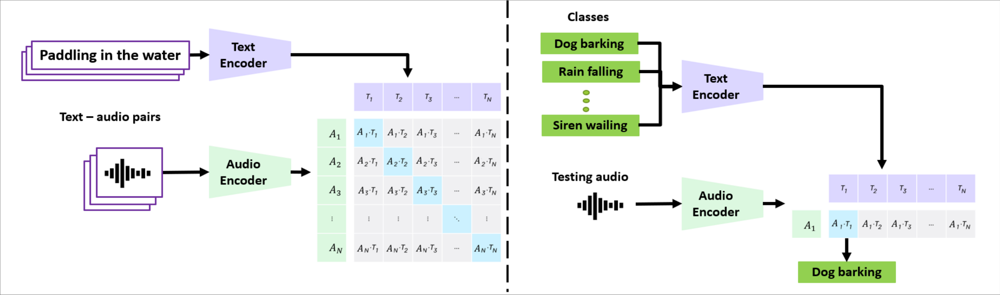
    

        Elizalde, B., Deshmukh, S., Al Ismail, M., & Wang, H. (2023, June). Clap learning audio concepts from natural language supervision. In ICASSP 2023-2023 IEEE International Conference on Acoustics, Speech and Signal Processing (ICASSP) (pp. 1-5). IEEE.
    

    
    

        https://digialps.com/stability-ais-new-open-source-ai-creation-stable-audio-2-0-takes-on-suno-ai/
    

Notes:

- We left the neural music production before the deep learning era, saying that there was no neural audio generation yet
- But that changed with the WaveNet model in 2016
- WaveNet used a clever trick in convolutional neural networks to model raw audio waveforms - it used so-called dilated convolutions to increase the receptive field of the network
- This allowed the model to capture long-range dependencies in audio signals, resulting in high-quality and realistic audio generation
- In 2017, Engel et al. introduced Neural Synthesis with WaveNet Autoencoders - a model that could generate musical notes by learning a latent representation of audio
- In 2019, the same team (Google Magenta) further advanced the field with Differentiable Digital Signal Processing (DDSP) - combining neural networks with traditional signal processing techniques
- Basically, they were predicting the parameters of an additive synthesizer with deep learning
- The key to this approach is that the synthesis process is differentiable, allowing for end-to-end training of the model
- In 2020, Steinmetz et al. proposed an approach for automatic mixing based on differentiable effects
- In 2021, Caillon and Esling introduced RAVE - a real-time audio synthesis model using variational autoencoders
- What works for images and text, should also work for audio - in 2022, CLAP was introduced - a model that learns audio concepts from natural language supervision
- And finally in 2024, Stable Audio Open was released - a model based on diffusion transformers for high-quality text-to-audio generation

---

<h1 style="font-size: 1.5em; margin-block: 20% 10%;">OUR RECENT RESEARCH CONTRIBUTIONS</h1>

    Selected work from the Computer Music and Neural Audio Systems Research Team 
    Audio Communication Group 
    Technische Universität Berlin

Notes:

- Ok, this was my overview of the academic field from its origins to the present day
- This area is receiving growing interest from research groups worldwide
- From us, as well
- So I'd like to show you three of our recent contributions in the years 2024 and 2025
- By "us" I refer to the Computer Music and Neural Audio Systems Research Team at the Audio Communication Group

---

<h2>Anira (Ackva, V.* & Schulz, F.*)</h2>

    <strong style="font-size: 1em; display: block; margin-bottom: 15px;">
        ANIRA: An Architecture for Neural network Inference in Real-time Audio applications
    </strong>
    

        → C++ Library that bridges the gap between neural audio research and real-time applications
    

    <h4 style="margin: 60px 0 0 0;">Key Contributions</h4>
    <ul>
        <li>Enables <strong>real-time safe</strong> neural network integration in DAWs and audio plugins</li>
        <li>Provides a framework for benchmarking neural networks in real-time scenarios</li>
        <li>Paper: <strong>First benchmark</strong> of neural audio effects models with different backends in real-time audio contexts</li>
    </ul>

<!-- 

    

        
        

            Documentation: <a href="https://anira-project.github.io/anira/">https://anira-project.github.io/anira/</a>
        

    

    

        
        

            Paper published at 2024 IEEE 5th International Symposium on the Internet of Sounds (IS2)
        

    

 -->

    <strong>Open-source • Extensive documentation • Permissive licensing</strong>

    Ackva, V., & Schulz, F. (2024). ANIRA: An Architecture for Neural Network Inference in Real-Time Audio Applications. <em>2024 IEEE 5th International Symposium on the Internet of Sounds (IS2)</em>, 1–10. https://doi.org/10.1109/IS262782.2024.10704099

Notes:

- The first contribution is ANIRA - an architecture for neural network inference in real-time audio applications - a project mainly by my colleague Valentin Ackva and me
- Inference is the process of using a trained neural network to make predictions on new data
- ANIRA is a C++ library that tries to bridge the gap between neural audio research and real-time applications
- It has two major focus areas - first the real-time safe integration of neural networks into DAWs, audio plugins and audio applications in general
- The second focus area is the performance evaluation of neural networks in audio applications
- For this ANIRA provides a framework for benchmarking neural networks in real-time scenarios
- And our paper was the first benchmark of neural audio effects models with different backends in real-time audio contexts
- Finally, ANIRA is open-source, has extensive documentation and permissive licensing

---

<h2>Neural Proxies for Sound Synthesizers (Combes, P., Weinzierl, S., Obermayer, K.)</h2>

    

        → How can we integrate non-differential synthesizers in deep learning pipelines for automatic synthesizer programming?
    

    <h4 style="margin: 60px 0 0 0;">Key Contributions</h4>
    <ul>
        <li>Method for training neural proxies for arbitrary synthesizers</li>
        <li>Evaluation of pretrained audio feature extraction models as proxy training representations</li>
        <li>Evaluation of method on synthesizer sound matching task</li>
    </ul>

<!-- 

    

        
        

            Repository: <a href="https://github.com/pcmbs/synth-proxy/">https://github.com/pcmbs/synth-proxy/</a>
        

    

    

        
        

            Paper published at Journal of the Audio Engineering Society, 73(9), 561–577.
        

    

 -->

    <strong>Open-source</strong>

    Combes, P., Weinzierl, S., & Obermayer, K. (2025). Neural Proxies for Sound Synthesizers: Learning Perceptually Informed Preset Representations. <em>Journal of the Audio Engineering Society, 73(9)</em>, 561–577. https://doi.org/10.17743/jaes.2022.0219

    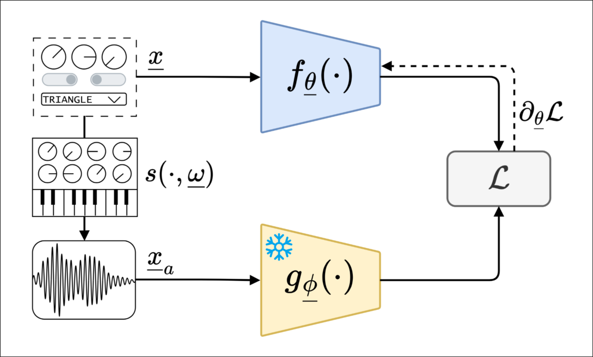
    

        Training of a neural proxy to mimic the behavior of a non-differentiable synthesizer
    

    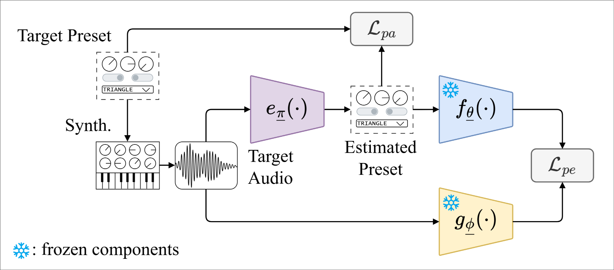
    

        Training of a synthesizer sound matching system using the neural proxy
    

<!-- 

 -->

Notes:

- The next contribution is Neural Proxies for Sound Synthesizers, primarily led by my colleague Paulo Combes
- The central question: how can we integrate non-differentiable synthesizers into deep learning pipelines for automatic synthesizer programming?
- In deep learning everything needs to be differentiable for our backpropagation algorithm to work
- This is why neural audio synthesis models like DDSP rely on differentiable synthesizers
- However, many high-quality synthesizers are non-differentiable, which limits their use in deep learning workflows
- Paulo's solution: neural proxies - differentiable neural networks that mimic non-differentiable synthesizer behavior
- The training process uses an audio feature extraction model (g()) to extract features from synthesizer output
- Then a neural network (f()) is trained to map synthesizer parameters to these extracted features
- The paper also provides extensive evaluation of different audio feature extraction models as proxy training representations
- Finally, the method was evaluated on synthesizer sound matching tasks
- Using the neural proxy (f()) to train a network (e()) that predicts synthesizer parameters for a given target sound

---

<h2>pGESAM (Limberg, C.*, Schulz, F.*, Zhang, Z., Weinzierl, S.)</h2>

    <strong style="font-size: 1em; display: block; margin-bottom: 15px;">
        pGESAM: pitch-conditioned GEnerative SAmple Map
    </strong>
    

        → How can musicians find the perfect samples in an effective and creative way? 
        → How can we generate samples that can be played expressively throughout different pitches?
    

    <h4 style="margin: 60px 0 0 0;">Key Contributions</h4>
    <ul>
        <li>Framework for successful generation of 4 second one-shot samples from 3 data-points</li>
        <li>Effective pitch-timbre disentanglement via semi-supervised learning (2D timbre, 1D pitch)</li>
        <li>Extensive evaluation on NSynth dataset</li>
    </ul>

<!-- 

    

        
        

            Web Demo: <a href="https://pgesam.faresschulz.com/">https://pgesam.faresschulz.com/</a>
        

    

    

        
        

            Paper published at 28th International Conference on Digital Audio Effects (DAFx25)
        

    

 -->

    <strong>Open-source • Web Demonstration</strong>

    Limberg, C., Schulz, F., Zhang, Z., & Weinzierl, S. (2025). Pitch-Conditioned Instrument Sound Synthesisfrom an Interactive Timbre Latent Space. <em>28th International Conference on Digital Audio Effects (DAFx25)</em>, 1–8. https://dafx.de/paper-archive/2025/DAFx25_paper_58.pdf

    

Notes:

- The last contribution is pGESAM - pitch-conditioned Generative Sample Map - a collaboration primarily between Christian Limberg and me
- Two central questions:
- How can musicians find the perfect samples in an effective and creative way?
- How can we generate samples that can be played expressively throughout different pitches?
- Key contributions: a framework generating 4-second one-shot samples from just 3 data points
- Three floats input, 4-second audio output
- These dimensions are disentangled - independent control over timbre (2D) and pitch (1D)
- Architecture overview: neural audio codec extracts embeddings (e), VAE learns low-dimensional timbre representation with disentangled pitch, pitch/timbre-conditioned transformer generates audio embeddings autoregressively
- Extensive evaluation on NSynth dataset demonstrates effectiveness
- Now I want to show you a quick demo of the pGESAM framework with our interactive web application

---

<h1 style="font-size: 2em; margin-block: 20% 10%;">OUTLOOK</h1>

Notes:

- To conclude this presentation, I want to give you a brief outlook on future directions in neural music production

---

## Future Directions in Neural Music Production

<strong style="font-size: 1.1em;">Deep Learning & Model Architectures</strong>

- Advanced sequence modeling for extended, coherent audio generation
- Methods for explainability and interpretability of neural audio models
- Synthetic data generation with generative models

<strong style="font-size: 1.1em;">Deployment & Real-time Performance</strong>

- Real-time inference optimization for low-latency audio processing
- Efficient model compression for resource-constrained devices
- Sample-rate agnostic architectures for flexible synthesis

<strong style="font-size: 1.1em;">Creative & Artistic Applications</strong>

- Improved control mechanisms for user-guided generation and processing
- Multi-modal conditioning for richer, more expressive outputs
- Enhanced embodiment in neural musical instruments

Notes:

- In the deep learning research area there is active work on long-term coherent generation, model explainability, and synthetic data creation
- For real-time contexts, inference optimization, model compression, and sample-rate agnostic architectures are important topics
- Finally, for creative applications, there is research in enhanced user control and better multi-modal conditioning, which would hopefully lead to more embodiment of neural musical instruments

---

<h1 style="margin: 24px 0 120px 0;">Thank You for Listening!</h1>

<strong>Any Questions?</strong>

    

        
    

    

        Anira Paper
    

    

        
    

    

        Neural Proxies Paper
    

    

        
    

    

        pGESAM Paper
    

---

<section data-background-image="assets/images/Last_Slide.jpg">

<!-- .slide: data-state="no-header no-footer" -->