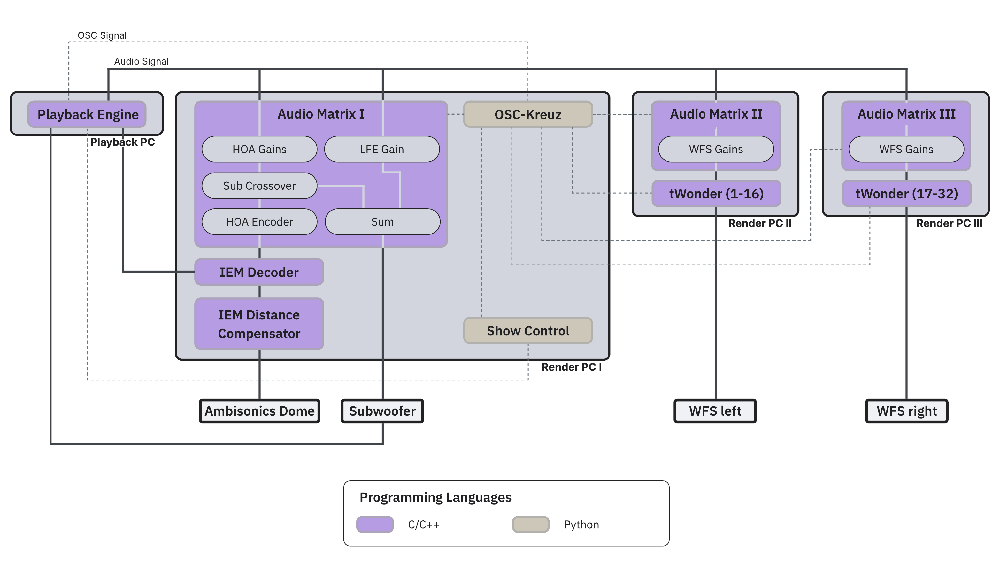
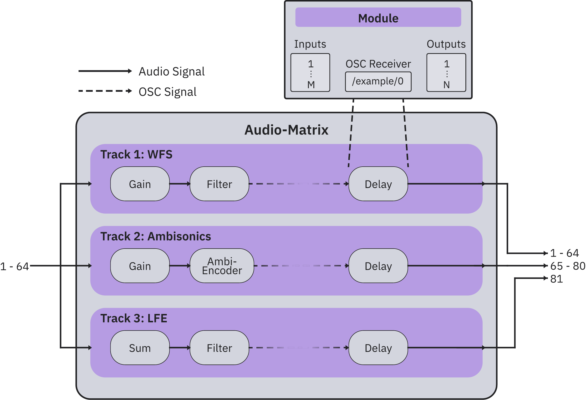
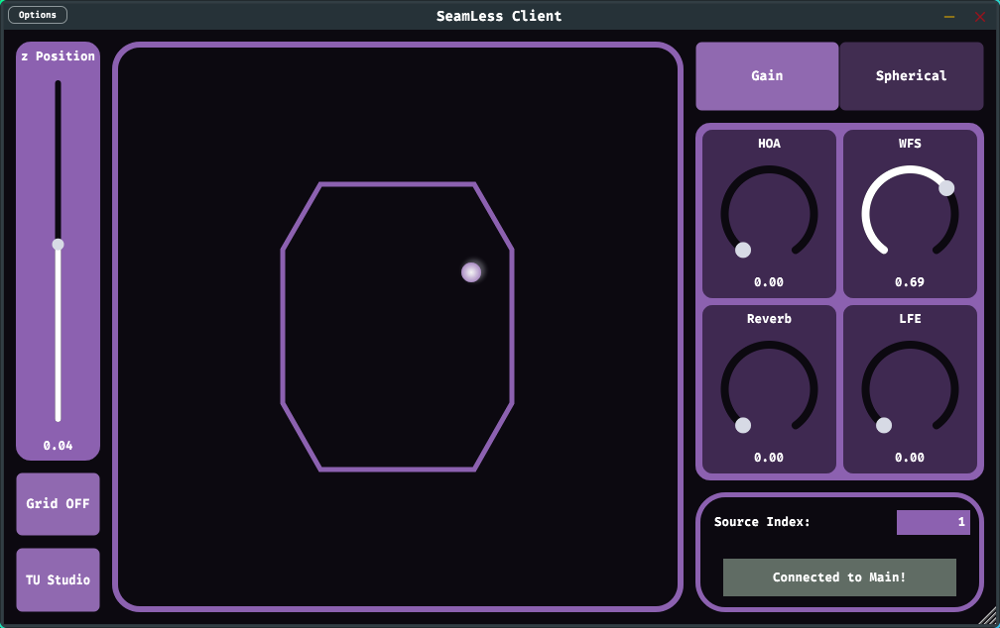
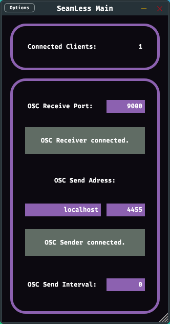
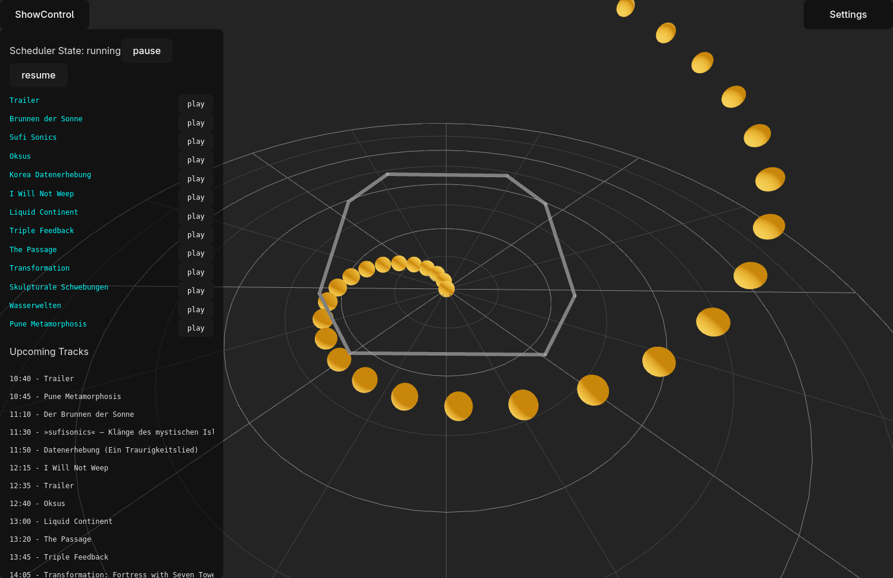

<h1 style="font-size: 1.8em; margin-block: 10% 10%; text-shadow: 0 0 20px var(--fs-background-color), 0 0 30px var(--fs-background-color)">SeamLess:<br> DISTRIBUTED SPATIAL AUDIO RENDERING
ON THE LINUX AUDIO STACK</h1>
<div style="display: flex; text-align: center; justify-content: space-between; align-items: flex-start; text-shadow: 0 0 20px var(--fs-background-color), 0 0 30px var(--fs-background-color)">
    <div style="font-size: 0.8em; text-align: center; color: var(--fs-text-muted-color);">
        <strong>Fares Schulz</strong><br>
        <div style="font-size: 0.8em; margin-bottom: 10px;">
            Researcher at the Audio Communication Group<br>
            Lead of Computer Music and Neural Audio Systems Research Team<br>
            Technische Universität Berlin
        </div>
    </div>
    <div style="font-size: 0.8em; text-align: center; color: var(--fs-text-muted-color);">
        <strong>Maximilian Weidauer</strong><br>
        <div style="font-size: 0.8em; margin-bottom: 10px;">
            Researcher at the Audio Communication Group<br>
            Technische Universität Berlin
        </div>
    </div>
</div>
Notes:

- Hello everyone

<!-- .slide: data-state="no-header no-footer", data-background-image="assets/images/SHF_eb00125547_Ethnologisches_Museum.jpg" -->

---
# Introduction

<!-- .slide: data-state="no-header no-footer" data-background-image="assets/images/hufo_image.jpg" data-background-opacity="0.55" -->

Notes:

- Let me set the stage for *why* we built SeamLess.
- Over the past decades, sound reproduction has moved well beyond two-channel and multichannel stereo.
- We now build large loudspeaker arrays — in concert halls, museums, and research studios — to reproduce sound in three dimensions.

---
## Spatial Sound Reproduction

- Beyond two-channel and multichannel stereo
- **Immersive, three-dimensional sound** over loudspeaker arrays
- Two widely used, **non-proprietary** methods:
    - **Ambisonics**
    - **Wave Field Synthesis (WFS)**
- Deployed in concert halls, museums, theatres and research studios

<div class="reference" style="margin-top: 30px;">
Schultz, Hahn &amp; Spors (2025), <em>Wellenfeldsynthese</em>, in: Handbuch der Audiotechnik, Springer.
</div>

Notes:

- Two methods dominate the open, non-proprietary landscape: Ambisonics and Wave Field Synthesis.
- Both are loudspeaker-based and both benefit from large channel counts.
- They are not competitors — they have complementary strengths, which is exactly why we want to combine them.

---
## Two Complementary Methods

<div style="display: flex; gap: 40px; margin-top: 30px;">
    <div class="tile color-0" style="flex: 1;">
        <h3>Ambisonics</h3>
        <div class="tile-description" style="height: auto; font-size: 0.6em;">
            <ul>
                <li>Domain-independent spatial audio format</li>
                <li>Sound field encoded on a <strong>sphere around the listener</strong></li>
                <li>Decoded to <strong>arbitrary</strong> loudspeaker layouts</li>
                <li>Strong for <strong>diffuse and elevated</strong> 3D fields</li>
            </ul>
        </div>
    </div>
    <div class="tile color-1" style="flex: 1;">
        <h3>Wave Field Synthesis</h3>
        <div class="tile-description" style="height: auto; font-size: 0.6em;">
            <ul>
                <li>Object-based: synthesizes <strong>wave fronts</strong> from many speakers</li>
                <li>Perceptually accurate <strong>localization</strong></li>
                <li>Enables <strong>focused sources</strong> inside the array</li>
                <li>Predominantly <strong>2D / horizontal</strong></li>
            </ul>
        </div>
    </div>
</div>

<div class="highlight" style="margin-top: 40px;">Combining both leverages their complementary strengths in a single system</div>

Notes:

- Ambisonics is domain-independent: a virtual source is projected onto a sphere around the listener and decoded to whatever loudspeaker layout you have. It shines for diffuse and elevated, three-dimensional fields.
- WFS is object-based: it synthesizes wave fronts by overlapping signals from a large number of speakers. This gives very accurate localization, and it can even place "focused" sources *inside* the listening area. But it is mostly used in 2D — horizontally — so it lacks native support for elevated sources.
- WFS gives you perceptual accuracy and focused sources for nearby, horizontal content; Ambisonics gives you diffuse and elevated 3D fields. SeamLess is built to do both.

---
## The Challenge of Scale

- Both methods benefit from **large channel counts** — hundreds of loudspeakers
- Computational + organizational demands **exceed a single machine**
- Our venues at TU Berlin and the Humboldt Forum:

<div style="display: flex; gap: 24px; margin-top: 24px; font-size: 0.62em;">
    <div class="tile" style="flex: 1; padding: 24px;">
        <strong>Ethnological Museum<br>(Humboldt Forum)</strong><br>
        256-channel WFS · 45-speaker HOA dome
    </div>
    <div class="tile" style="flex: 1; padding: 24px;">
        <strong>TU Studio</strong><br>
        192-channel WFS · 21-channel Ambisonics dome · 8-speaker ring
    </div>
    <div class="tile" style="flex: 1; padding: 24px;">
        <strong>Lecture Hall H 0104</strong><br>
        832-channel WFS · 600+ seats
    </div>
</div>

<div class="highlight" style="margin-top: 36px;">Driving hundreds of speakers calls for <strong>distributed processing across multiple hosts</strong></div>

Notes:

- Both methods scale with channel count — more speakers means a more convincing field, but also more processing.
- At a certain size, a single workstation simply cannot keep up: the computational and organizational demands exceed one machine.
- Concretely: the Humboldt Forum listening room runs 256 WFS channels plus a 45-speaker Ambisonics dome; our TU Studio combines a 192-channel WFS system, a 21-channel dome and an 8-speaker ring; and our largest install — Lecture Hall H 0104 — drives 832 WFS channels for an audience of over 600.
- These numbers are the core driver for distributing the rendering across many machines.

---
## Existing Solutions

Mature systems exist — but each leaves a gap for large-scale, open, distributed Linux setups.

| System | Open source | Linux | WFS | Distributed |
|---|:---:|:---:|:---:|:---:|
| IRCAM **Spat** | ✗ (free, proprietary) | ✗ | ✓ | ✗ |
| **Holoplot** | ✗ | embedded | ✓ | custom HW |
| **SSR** | ✓ | ✓ | ✓ | ✗ |
| **TASCAR** | ✓ | ✓ | ~ | ✗ |
| **IEM** / **SPARTA** plug-ins | ✓ | ✓ | ✗ | ✗ |
| **SeamLess** | ✓ | ✓ | ✓ | ✓ |

<div class="reference" style="margin-top: 20px;">
Carpentier et al. (Spat, ICMC 2015) · Geier et al. (SSR) · Grimm et al. (TASCAR) · Rudrich et al. (IEM) · McCormack &amp; Politis (SPARTA, AES 2019)
</div>

Notes:

- The landscape splits into two families. First, integrated rendering frameworks that process the audio themselves: IRCAM's Spat is the most comprehensive — VBAP, Ambisonics, DBAP, WFS — but it lives inside Max/MSP, targets macOS and Windows, and is proprietary. Holoplot's WFS panels are state of the art (the Las Vegas Sphere), but proprietary and tied to their own hardware. The SoundScape Renderer is open-source, Linux-capable, supports WFS — but renders on a single machine. TASCAR is Linux-native and open, oriented toward hearing-aid research and controlled experiments rather than large arrays.
- Second, DAW plug-in suites — IEM, Kronlachner's Ambisonic suite, SPARTA. All open and cross-platform, but Ambisonics-only, no WFS, and confined to single-machine rendering inside a host.
- So: plenty of good tools, but none combine open-source, Linux-first, WFS support, *and* distributed multi-machine rendering. That last column is the gap.

---
## Limitations of Existing Systems

- Limited **portability of pieces** between venues
- Channel count **limited by soundcard outputs and processing power** of one machine 
- **Proprietary** hardware and software 
- **Steep costs** — out of reach for smaller, budget-conscious setups 
- No **deployment automation** or **show scheduling** for permanent installations

Notes:

- Pulling those gaps together: pieces are hard to move between venues because loudspeaker-specific configuration is baked in. Channel count is capped by a single machine's soundcard outputs and CPU. Much of the ecosystem is proprietary and expensive — which prices out smaller venues. And almost none of these systems were designed for permanent installations, so deployment automation and show scheduling are missing entirely.
- These are exactly the problems SeamLess sets out to solve — which Maximilian will now walk you through in detail.

---
# SeamLess
<!-- .slide: data-state="no-header no-footer" data-background-image="assets/images/hufo_image.jpg" data-background-opacity="0.55" -->
---

## SeamLess - Overview
- **Modular** software stack
- Highly **Configurable** compononents
- **Distributed** rendering
- **Complexity** is **hidden** from users 
    (only mono audio streams and positional data using OSC)
- Management through common Linux tools (systemd, JACK/PipeWire, Ansible, meson)
- Pieces are (reasonably) **portable**
  - Shared, normalized coordinate system between all venues

Notes:
- modular software stack -> components can be chosen based on setup, and also replaced -> also flexible in choice of rendering software
- all components also very configurable, mostly using yaml files
- Distributed rendering -> not limited by outs and performance
- Rendering on backend -> complexity and implementation details hidden
- linux tools
- coordinate system is normalized: wall farthest from the center at distance 0.5 on either the x- or y-axis. transfer between different locations without rescale
- of course room differences, so never true portability, but at least its possible, especially between similar systems like hufo and TU


---
## 

<div class="image-overlay">
    
</div>

Notes:
- overview of signal flow in one of our installations, at hufo
- route audio to rendering machines, further processed, all linux runing JACK or PipeWire, 
    - pipewire (for us) only recently possible due to removing 64 channel hardware limit, since we use soundcards with 128 or 192 outputs

- Synchronization handled by audio hardware, either dante or wordclock or in the future aes67 using PTP

- lets take smol look at the different components

---
## OSC-Kreuz

<div class="highlight" style="margin-top: 40px;"> OSC routing hub and central source of truth </div>

- support for positional data, gains and WFS parameters
- Automatic conversion between different coordinate formats
- Per-source rate limiting
- Receivers can subscribe using OSC based protocol

Notes:
- Python, central osc routing hub and source of truth by keeping track of state
- currently supports positional data, gains for all rendering engines and special WFS parameters (point source or plane wave?)
- translates between cartesian and spherical coordinates, depending on what is received
- configurable
- rate limiting (smoother movement wfs (doppler))
- receivers either specified in config file or subscribe during runtime
- if special format is needed new receiver subclass can be easily created
  - cwonder as example
--

<div class="image-overlay">
    
    <div class="detail-rect" style="top: 17%;left:43%;width:13%;height:6%" />
</div>

Notes:
exists one time in the system
---

## Audio-Matrix
<div class="highlight" style="margin-top: 40px;"> Flexible multichannel DSP  </div>

<div class="image-overlay fragment appear-vanish" data-fragment-index="0" style="width: 82%">
    
</div>

- Preprocessing and gains
- OSC controllable
- Channel count calculated during initialization stage
- Modules: **Gain**, **Ambisonics Encoder**, **Sum**, **Filter**, **Distance Gain**, **Delay**

<div class="fragment"></div>
Notes:
- C++
- heavily configurable using yaml
- preprocessing for actual renderers (wfs/hoa)
- most important task: Gains for rendering systems
- OSC controllable

OPEN OVERLAY
- signal split to multiple tracks, each track configurable modules

CLOSE OVERLAY
- output channel count calculated during initialization
- new modules relatively easy to add, access to osc server (liblo)

--

<div class="image-overlay">
    
    <div class="detail-rect" style="top: 17%;left:18%;width:25%;height:25.5%"></div>
    <div class="detail-rect" style="top: 17%;left:60.5%;width:13%;height:13%"></div>
    <div class="detail-rect" style="top: 17%;left:78.2%;width:13%;height:13%"></div>

</div>

Notes:
- gains
- summing for sub
- encoding

---
## Wonder
<div class="highlight" style="margin-top: 40px;"> Wave field synthesis Of New Dimensions of Electronic music in Realtime </div>

- WFS Rendering Suite, renderer **tWonder**
- tWonders can be distributed accross different machines
- Support for focused and unfocused sources
- Multicast to increase synchronicity of OSC messages
- Started using systemd template service and custom target

<div class="speaker-polygon fragment" style="top: 33%;left:70%;width:15%;height:70%;">
    <div class="speaker-source fragment fade-in-then-out" style="top: 1%;left:99%;"></div>
    <div class="speaker-source fragment" style="top: 17%;left:60.5%;"></div>
</div>


Notes:
- our WFS rendering suite, developed at TU for 20 years now
- Stripped down, only actual renderer tWonder is used, since followed similar design principle as seamless on the whole, that's why message router cWonder could be drop-in replaced by OSC-Kreuz
- each twonder handles subset of speaker-panels (cheap way of getting multithreading, since independent of each other), thus can be distributed by having knowledge about connected speakers and layout of the full system
- cwonder supplies room polygon
- focused vs unfocused sources, 
polygon information is used to determine if panel is needed for source
- rendering: gains and delays based on distance from virtual sound source
- Multicast to increase synchronicity of OSC messages
- Started using systemd template service and custom target to monitor state of up to 16 tWonders per machine


--

<div class="image-overlay">
    
    <div class="detail-rect" style="top: 30%;left:60.5%;width:13%;height:6%"></div>
    <div class="detail-rect" style="top: 30%;left:78.2%;width:13%;height:6%"></div>
</div>
---

## Ambisonics Decoding

- Decoding and Distance Compensation with modified IEM plugins
- Built without GUI
- Encoding within Audio-Matrix

Notes:
- not configured using yaml :(
- configuration bit more complicated, 
  - first need to calculate the decoder/config on machine running gui version, 
  - then copy the state over
--

<div class="image-overlay">
    
    <div class="detail-rect" style="top: 43%;left:18%;width:13.5%;height:16.5%"></div>

</div>
---

## Playback Engine
<div class="highlight" style="margin-top: 40px;"> Feed audio and control data into the system</div>
Any program with multichannel audio playback and OSC output or VST plugin-support

**REAPER** with **SWS Extensions**

| Channels | Mapping |
| --- | --- |
| 1-32 | Virtual Sources|
|33-48 | Encoded ambisonics up to 3rd order |
| 50 | LFE direct |

Notes:
- playback engine could be any program with multichannel audio playback and OSC output or VST plugin-support
- on the playback machine in the hufo REAPER with SWS extensions
- currently the only non-free component
- chosen for 
  - **stability**, (unreasonably stable) 
  - **familiarity** of artists, 
  - osc **remote** control, 
  - lua **scripting**, 
  - **adoption** within spatial audio scene
- one big session with all pieces, that can get started with OSC and stopped using sws
--

<div class="image-overlay">
    
    <div class="detail-rect" style="top: 17%;left:2%;width:13%;height:6%" />
</div>
---

## SeamLess Plugin Suite



Notes:
- Client side plugins for controlling positions and gains
- JUCE plugins for most DAWs
- no processing, just OSC
- Main handles state and communication
- Clients connect using ipc
- split allows keeping positional data and automation grouped with audio data
---

## ShowControl
<div class="highlight" style="margin-top: 40px;"> Scheduling and Playback Control </div>


Notes:
- Scheduler, in museum context
- python with frontend with flask, typescript/react
- controls reaper and sends broadcasts for video screens MPV
- schedule is generated from blocks of pieces
- pieces, blocks and schedules are of course yml files
- additional features like this webGL based source viewer
- also APIs for controlling and getting status, info screens and emergency playback stopping
--

<div class="image-overlay">
    
    <div class="detail-rect" style="top: 52.5%;left:43%;width:13%;height:6%" />
</div>
---

## Jack-Connection-Manager
<div class="highlight" style="margin-top: 40px;"> Manage JACK/PipeWire connections between clients with high number of ports </div>


```yaml [|1-3,9-10|4-8,11-12]
- client: audio-matrix:wfs_
  n_channels: 32
  start_index: 0
  connections:
    - client: twonder1:input
    - client: twonder2:input
    - client: twonder3:input
    - client: twonder4:input
- client: twonder1:speaker
  n_channels: 16
  connections:
    - client: system:playback_
```

Notes:
- simple python program that runs as daemon
- focus on readable and concise configs, instead of just creating snapshots or saving every connection individually, because we don't have that many clients, but each has a lot of connections
- NEXT: instead of specifying connections specify client and the amount of channels, optionally start index, 
- NEXT: then we define the clients with port names to connect it to
- might be made obsolete by wireplumber/lua, but due to simple syntax might stay around, since it also works for pipewire, burn that bridge when get to it
---
# Orchestration
<!-- .slide: data-state="no-header no-footer" data-background-image="assets/images/hufo_image.jpg" data-background-opacity="0.55" -->

---
## Configs

- All of our configs in one repo
- Installed using Meson build system
- correct configs chosen for **location** and **node**

| location | node |
| --- | --- |
| `EN325` | `riviera` |
| | `wintermute` |
| `HUFO` | `playstation` |
| | `renderer01` - `03` |
| `H0104` | `tengo` |
| | `kaoru01` - `05` |

Notes:
- All of our configs in one repo, probably what is changed the most often
- Installed using Meson build system
- meson is used (abused?) for most installations, including python, where it just calls the correct tools, and then moves the files to their locations
- correct configs chosen for **location** and **node**
- sometimes we have uniquely named machines, sometimes numbered, the logic is contained within meson scripts
---
## Versioned Install
<div class="highlight" style="margin-top: 40px;"> Strict versioning for installed software </div>
String based on current git tag version is appended to filenames/directories

<pre><code data-noescape class="language-txt hljs" data-highlighted="yes" data-line-numbers="3,7|2,5-6">/usr/local/bin/
├── audio-matrix -> /usr/local/bin/audio-matrix-<span class="hljs-keyword textit">version</span>
└── audio-matrix-<span class="hljs-keyword textit">version</span> 
/usr/local/etc/
├── audio-matrix 
│    -> /usr/local/etc/audio-matrix-<span class="hljs-keyword textit">location</span>-<span class="hljs-keyword textit">node</span>-<span class="hljs-keyword textit">version</span>/
└── audio-matrix-<span class="hljs-keyword textit">location</span>-<span class="hljs-keyword textit">node</span>-<span class="hljs-keyword textit">version</span>
</code></pre>


Notes:
- high reliability requirements, limited time to work, thus quick rollback required
- similar to how library versions are managed
---
## Versioned Install
<div class="highlight" style="margin-top: 40px;"> Strict versioning for installed software </div>
String based on current git tag version is appended to filenames/directories

<pre><code data-noescape class="language-txt hljs" data-highlighted="yes" data-line-numbers="2-3|6-7|5">/usr/local/share/
└── osc-kreuz-<span class="hljs-keyword textit">version</span>/
    └── venv/*
/usr/local/bin/
├── osc-kreuz -> /usr/local/bin/osc-kreuz-<span class="hljs-keyword textit">version</span>
└── osc-kreuz-<span class="hljs-keyword textit">version</span> -> 
        /usr/local/share/osc-kreuz-<span class="hljs-keyword textit">version</span>/venv/bin/osc-kreuz
</code></pre>

Notes:
for python applications like osc-kreuz venv

---
## Deployment
<div class="highlight" style="margin-top: 40px;"> Infrastructure as Code </div>
Ansible Playbooks to go from fresh Debian installation to complete SeamLess system

<div class="image-overlay fragment appear" data-fragment-index="1" data-fragment-span="4">
    <pre>
<code data-trim data-line-numbers="1,11|2-5,9-10,12-15|6-8,16-18" data-fragment-index="2" style="font-size: 0.8em">renderer:
  hosts:
    renderer01:
      ansible_host: renderer01.local
      ansible_user: username
      services: [osc-kreuz, jack-connection-manager, audio-matrix, ambisonics]
      location: HUFO
      audio_driver: dante
    renderer02:
      ...
player:
  hosts:
    playstation:
      ansible_host: playstation.local
      ansible_user: username
      services: [jack-connection-manager, gui, showcontrol]
      location: HUFO
      audio_driver: [dante]
</code></pre>
</div>

### Setting up new SeamLess system
0. Build a system
1. Set up Ansible inventory <!-- .element: class="fragment" data-fragment-index="0" -->
2. Create config files <!-- .element: class="fragment" data-fragment-index="6" -->
3. Run main playbook <!-- .element: class="fragment" data-fragment-index="7" -->


Notes:
- use ansible for management and deployment. does everything from installing software, setup system

- you of course need to build a system first, and handle audio routing in some way, but that's nothing we can automate
 
- to go about setting up new seamless system first create inventory
  - groups of hosts: renderer, player
  - actual hosts with host and usernames
  - custom variables: 
    - services define which software gets installed
    - location is passed to the meson config install script
    - audio driver defines which drivers get installed


- caveats to this: location specific scripts for proxies etc

---
# Conclusion

<!-- .slide: data-state="no-header no-footer" data-background-image="assets/images/SHF_eb00125547_Ethnologisches_Museum.jpg" data-background-opacity="0.5" -->

Notes:

- Let me tie this back together.

---
## What We Presented

- **SeamLess** — a modular, open-source, real-time spatial audio rendering platform
- Built **entirely on the Linux audio stack**
- **Distributes** rendering across multiple commodity Linux servers
- **Separates** the rendering backend from user interaction
    - artists work through familiar **DAW plug-ins** and plain **OSC**
- Scales to large arrays — **up to 832 channels** in our largest install

Notes:

- In short: SeamLess is a modular, open-source, real-time spatial audio rendering system built entirely on the Linux audio stack.
- It distributes the rendering workload across a cluster of commodity Linux servers, and it cleanly separates that backend from how artists interact with it — DAW plug-ins and OSC messages.
- That separation is what lets the same piece scale from a small studio up to our 832-channel lecture hall without the artist having to think about the cluster underneath.

---
## The Linux Audio Stack is Ready

- **JACK** — and more recently **PipeWire** — proved mature enough for demanding, high-channel-count spatial audio in production
- PipeWire removed the previous **64-channel hardware limit**
- **WirePlumber** scripting + native **AES67** support are a promising foundation

<div class="highlight" style="margin-top: 36px;">Open, Linux-based rendering is viable for real-world, large-scale installations</div>

Notes:

- One of our main takeaways is that the Linux audio stack is genuinely ready for this. JACK — and now PipeWire — handle demanding, high-channel-count spatial audio reliably in production.
- The recent PipeWire work that removed the 64-channel hardware limit was a turning point for us.
- And looking forward, WirePlumber's scripting capabilities plus PipeWire's native AES67 support are a very promising foundation for networked audio systems.

---
## Operational Experience

- Running **continuously since May 2025** at the Berlin Humboldt Forum
- **systemd** services + **Ansible** deployment + strict **version control**
    - the reliability a permanent museum exhibit demands
- A central concern throughout: **reliability and reproducibility**

<div class="reference" style="margin-top: 24px;">
Permanent exhibition, Ethnological Museum — Humboldt Forum, Berlin
</div>

Notes:

- This is not just a lab prototype. The system has run continuously at the Humboldt Forum since around May 2025, with only occasional restarts after updates.
- That kind of uptime in a permanent museum exhibit is only possible because reliability was a central concern from the start: every component runs as a systemd service, deployment is automated with Ansible, and strict version control lets us roll back when something breaks.
- REAPER, perhaps surprisingly, has been a very stable playback engine for our five-hour single-session show.

---
## Outlook

- Replace the proprietary **REAPER** playback engine with a **custom open-source** solution
- Further investigate **PipeWire stability** under sustained, high-channel-count load
<!-- - TODO benchmark synchronicity? -->
- Explore rendering methods **beyond WFS and Ambisonics**
- Adopt **AES67** for networked audio — motivated by poor Linux support for MADI/Dante drivers

Notes:

- Looking ahead, a few directions. We want to replace the one proprietary piece left in the chain — the REAPER playback engine — with a custom, open-source playback solution, partly for licensing and partly for scalability.
- We want to keep stress-testing PipeWire under sustained, high-channel-count load.
- We'd like to support rendering methods beyond just WFS and Ambisonics.
- And AES67 is high on the list: the audio drivers themselves — MADI and Dante — are a real pain point because of immature Linux support, which is exactly what motivates moving to AES67 over standard networking.

---
## Making Spatial Audio Accessible

- Fully **open-source**, **Linux-first**, built on **standard hardware**
- Viable for **large-scale venues** *and* **smaller, budget-conscious setups**
- The open nature invites **adoption and contribution** from other institutions

<div class="highlight" style="margin-top: 40px;">Thank you! — github.com/tu-studio</div>

Notes:

- The bigger picture: because SeamLess is fully open-source, Linux-first, and runs on standard commodity hardware, it lowers the barrier to spatial audio — not only for large institutions but for smaller, budget-conscious setups too.
- And being open, it invites adoption and contributions from other institutions running comparable systems.
- All of the components — the audio matrix, OSC-Kreuz, Wonder, the plug-in suite, the configs — are on our GitHub at github.com/tu-studio. Thank you — happy to take questions.


