<h1 style="font-size: 1.8em; margin-block: 16% 10%;">ADVANCES IN NEURAL MUSIC PRODUCTION</h1>

    <strong>Fares Schulz</strong> 
    

        Researcher at the Audio Communication Group 
        Lead of Computer Music and Neural Audio Systems Research Team 
        Technical University of Berlin
    

Notes:

- Hello everyone
- I will be presenting the history and latest advances of neural music production
- My name is Fares Schulz
- Researcher at Audio Communication Group, Technical University of Berlin (like my colleague Annika)
- Lead of Computer Music and Neural Audio Systems

<!-- .slide: data-state="no-header" -->

---

## AI Overview

    

        

            
        

        

            <strong>Nested Relationship:</strong> AI ⊃ ML ⊃ NN ⊃ DL
        

    

    

        <h4>Hierarchical Relationship</h4>
        <ul>
            <li><strong>Artificial Intelligence (AI):</strong> Machines performing tasks requiring human-like intelligence</li>
            <li><strong>Machine Learning (ML):</strong> Algorithms that learn patterns from data without explicit programming</li>
            <li><strong>Neural Networks (NN):</strong> Interconnected nodes inspired by biological neurons</li>
            <li><strong>Deep Learning (DL):</strong> Uses multi-layered neural networks to model complex patterns</li>
        </ul>
    

  
<strong>Neural Music Production</strong> = Creative applications of neural networks in the music production domain

Notes:

- Let's start with a quick overview of artificial intelligence
- With AI, we refer to machines that can perform tasks that typically require human-like intelligence
- Machine learning is a subset of AI that focuses on algorithms that can learn patterns from data without being explicitly programmed
- Neural networks are a specific type of machine learning model inspired by the structure and function of biological neurons
- Deep learning is a subset of neural networks that uses multiple layers to model complex patterns in data

---

<h1 style="font-size: 1.5em; margin-block: 20% 10%;">HISTORY OF NEURAL MUSIC PRODUCTION</h1>

Notes:

- Before showing some of our research I will give an overview of the evolution of neural music production, highlighting key milestones and recent advancements
- As the field is extremely broad and fast-moving and I will only be able to cover a small part of it
- But I hope this will give you a good overview of the field and inspire you to explore further

---

## Early History of Neural Networks

    

        
Architectures & Layers

        
Evolution of network architectures and layer innovations

    

    

        

        

            

                
1957

                
Perceptron

                
Rosenblatt, F.

            

        

        

        

        

            

                
1979

                
Convolutional Networks

                
Fukushima, K.

            

        
 
        

        

        

            

                
1982

                
Recurrent Networks

                
Hopfield

            

        

        

        

        

            

                
1986

                
Backpropagation

                
Hinton et al.

            

        

        

        

        

            

                
2006

                
Deep Belief Networks

                
Hinton, G. et al.

            

        

        

        

        

            

                
2012

                
AlexNet

                
Krizhevsky et al.

            

        

        

    

    

    
    

        https://www.cudocompute.com/topics/neural-networks/introduction-to-recurrent-neural-networks-rnns
    

    
    

        Fukushima, K. (1980). Neocognitron: A self-organizing neural network model for a mechanism of pattern recognition unaffected by shift in position. Biological Cybernetics, 36(4), 193–202. https://doi.org/10.1007/BF00344251
    

    
    

        https://www.cudocompute.com/topics/neural-networks/introduction-to-recurrent-neural-networks-rnns
    

    
    

        https://www.linkedin.com/pulse/backpropagation-neural-networks-brain-behind-deep-learning-ali-v8fsf
    

    
    

        https://www.analyticsvidhya.com/blog/2022/03/an-overview-of-deep-belief-network-dbn-in-deep-learning/
    

    
    

        Krizhevsky, A., Sutskever, I., & Hinton, G. E. (2012). Imagenet classification with deep convolutional neural networks. Advances in neural information processing systems, 25.
    

Notes:

- To understand the evolution of neural music production, I want to look first at the early history of neural networks
- In 1957, the perceptron was introduced by Frank Rosenblatt, marking the beginning of neural network research
- It was a simple model that could learn to classify inputs into different categories, by adjusting weights based on errors
- These errors were calculated from prelabeld data, which is called supervised learning
- Later, the multi-layer perceptron (MLP) was developed, allowing for more complex representations of data
- In 1979, convolutional neural networks (CNNs) were introduced - replacing the multiplications with convolution operations
- And two years later - Hopfield networks were proposed, introducing recurrent connections - temporal dynamics
- Then the backpropagation algorithm enabled training of multi-layer networks - efficiently computing gradients
- Before the deep learning era, Deep Belief Networks (DBNs) were proposed as a way to pre-train deep networks layer by layer
- Finally, in 2012, AlexNet demonstrated the power of large deep convolutional networks on image classification tasks - marking the beginning of the deep learning revolution

---

## Early History of Neural Music Production

    

        

            
Key Milestones

            
Significant developments in neural music production

        

        

            

                

                

                    

                        
1957

                        
Perceptron

                    

                

                

                

                

                    

                        
1979

                        
CNN

                    

                
 
                

                

                

                    

                        
1982

                        
RNN

                    

                

                

                

                

                    

                        
1986

                        
Backpropagation

                    

                

                

                

                

                    

                        
2006

                        
Deep Belief Networks

                    

                

                

                

                

                    

                        
2012

                        
AlexNet

                    

                

                

            

            

                

                

                    

                        
1960

                        
LMS Filtering

                        
Widrow & Hoff

                    

                
 
                

                

                

                    

                        
1987

                        
NN for Phoneme Recognition

                        
Waibel et al.

                    

                

                

                

                

                    

                        
1989

                        
RNN for Symbolic Music Generation

                        
Todd

                    

                

                

                

                

                    

                        
1989

                        
Gradient Descent for Musical DSP

                        
Shynk & Moorer

                    

                

                

                

                

                    

                        
1997

                        
NN for Analog Effects Modeling

                        
Zhang & Duhamel

                    

                

                

                

                

                    

                        
1999

                        
NN for Piano Transcription

                        
Matija Marolt

                    

                

                

                

                

                    

                        
2009

                        
Audio features with DBN

                        
Lee et al.

                    

                

                

            

        

    

    <h3>Least Mean Square Filtering 
    (Widrow & Hoff)</h3>
    <ul>
        <li>Adaptive filtering algorithm for noise cancellation and echo suppression</li>
        <li>Uses <strong>stochastic gradient descent</strong> to minimize error between desired and actual output</li>
        <li>SGD = Foundation for later neural network training methods</li>
    </ul>

    
    

        Todd, P. M. (1989). A Connectionist Approach to Algorithmic Composition. Computer Music Journal, 13(4), 27–43.
    

    <h3>Neural Networks for Piano Transcription
     (Matija Marolt)</h3>
    <ul>
        <li>Division of audio signals into frequency bands</li>
        <li>One Multilayer Perceptron (MLP) for each band</li>
    </ul>

    <h3>Unsupervised Audio Feature Learning with Deep Belief Networks 
    (Lee et al.)</h3>
    <ul>
        <li>Learning Audio Features from Unsupervised Data</li>
        <li>Outperformed traditional hand-crafted features in many classification tasks</li>
    </ul>

Notes:

- Now let's look at some key milestones in neural music production during this early history
- Allready in 1960, Widrow and Hoff introduced the Least Mean Square filtering algorithm
- Then 27 years later, neural networks were applied to phoneme recognition
- In 1989, Peter Todd used RNNs for symbolic music generation
- In the same year, there have been first attempts to use gradient descent for musical DSP
- In 1997, neural networks were used the first time for modeling analog effects
- Music transcription with neural networks dates back to 1999, with Matija Marolt's work on piano transcription
- Finally in 2009, Lee et al. demonstrated the effectiveness of deep belief networks for learning audio features from unsupervised data

---

## Early History of Neural Music Production

    

        

            
Key Milestones

            
Significant developments in neural music production

        

        

            

                

                

                    

                        
1957

                        
Perceptron

                    

                

                

                

                

                    

                        
1979

                        
CNN

                    

                
 
                

                

                

                    

                        
1982

                        
RNN

                    

                

                

                

                

                    

                        
1986

                        
Backpropagation

                    

                

                

                

                

                    

                        
2006

                        
Deep Belief Networks

                    

                

                

                

                

                    

                        
2012

                        
AlexNet

                    

                

                

            

            

                

                

                    

                        
1960

                        
LMS Filtering

                        
Widrow & Hoff

                    

                

                

                

                

                    

                        
1987

                        
NN for Phoneme Recognition

                        
Waibel et al.

                    

                

                

                

                

                    

                        
1989

                        
RNN for Symbolic Music Generation

                        
Todd

                    

                

                

                

                

                    

                        
1989

                        
Gradient Descent for Musical DSP

                        
Shynk & Moorer

                    

                

                

                

                

                    

                        
1997

                        
NN for Analog Effects Modeling

                        
Zhang & Duhamel

                    

                

                

                

                

                    

                        
1999

                        
NN for Piano Transcription

                        
Matija Marolt

                    

                

                

                

                

                    

                        
2009

                        
Audio features with DBN

                        
Lee et al.

                    

                

                

            

        

    

    

        <h3>Gradient Descent Based Digital Signal Processing</h3>
        

            Use gradient descent to optimize parameters of digital signal processing algorithms for tasks like audio effects modeling and synthesis.
        

    

    

        <h3>Feature Extraction with Neural Networks</h3>
        

            Use neural networks to automatically learn and extract relevant features from audio data for tasks like classification, transcription, and analysis.
        

    

    

        <h3>Symbolic Music Generation with Neural Networks</h3>
        

            Use neural networks to generate symbolic music representations, such as music notation or MIDI sequences, for composition and arrangement tasks.
        

    

  
What about <strong>neural audio synthesis</strong>?

Notes:

- I would like to highlight that these early works can be categorised into three main areas.
- First, gradient descent based digital signal processing - using gradient descent to optimize parameters of DSP algorithms
- Second, feature extraction with neural networks - using neural networks to automatically learn and extract relevant features
- And the third category is symbolic music generation with neural networks
- But what about neural audio synthesis?

---

## The Deep Learning Era

    

        
Deep architectures

        
Deep architectures and generative models transforming AI capabilities

    

    

        

        

            

                
2013

                
Variational Autoencoders

                
Kingma & Welling

            

        

        

        

        

            

                
2014

                
Generative Adversarial Nets

                
Goodfellow et al.

            

        

        

        

        

            

                
2015

                
Diffusion

                
Sohl-Dickstein et al.

            

        

        

        

        

            

                
2017

                
Transformers

                
Vaswani et al.

            

        

        

        

        

            

                
2021

                
CLIP

                
Dosovitskiy & Radford

            

        

        

        

        

            

                
2022

                
Diffusion Transformer

                
Peebles & Xie

            

        

        

        

        

            

                
2023

                
Mamba

                
Gu & Dao

            

        

        

    

    
    

        https://theaisummer.com/Autoencoder/
    

    
    

        https://www.linkedin.com/pulse/what-generative-adversarial-networks-gans-sushant-babbar-qpc9c
    

    
    

        Ho, J., Jain, A., & Abbeel, P. (2020). Denoising diffusion probabilistic models. Advances in neural information processing systems, 33, 6840-6851.
    

    
    

        Vaswani, A., Shazeer, N., Parmar, N., Uszkoreit, J., Jones, L., Gomez, A. N., ... & Polosukhin, I. (2017). Attention is all you need. Advances in neural information processing systems, 30.
    

    
    

        Radford, A., Kim, J. W., Hallacy, C., Ramesh, A., Goh, G., Agarwal, S., ... & Sutskever, I. (2021). Learning transferable visual models from natural language supervision. In International conference on machine learning (pp. 8748-8763). PmLR.
    

    
    

        https://digialps.com/stability-ais-new-open-source-ai-creation-stable-audio-2-0-takes-on-suno-ai/
    

Notes:

- Well for neural audio synthesis we need the inventions of the deep learning era - first an overview of key milestones in deep learning in general
- In 2013, Variational Autoencoders were introduced - ability to generate new data points by sampling from a learned distribution - the latent distribution
- Learn in an unsupervised manner to encode input data into a compressed representation and then decode it back to the original input
- Generation of new data points by sampling from the latent distribution
- In 2014, Generative Adversarial Networks were proposed - two neural networks competing against each other
- In 2015, Diffusion models were introduced - iterative denoising process to generate high-quality samples
- In 2017, Transformers revolutionized sequence modeling with self-attention mechanisms
- In 2021, CLIP demonstrated the power of multi-modal learning by connecting images and text
- Two encoders that map images and text into a shared latent space - by using contrastive learning the images and text are mapped close to each other in the latent space
- It could for example classify images, without ever being trained on that specific task
- In 2022, Diffusion Transformers combined the strengths of diffusion models and transformers
- And finally in 2023, Mamba was introduced - a new architecture for sequence modeling

---

## Deep Neural Music Production

    

        

            
Key Milestones

            
Significant developments in deep neural music production

        

        

            

                

                

                    

                        
2013

                        
VAE

                        
Kingma & Welling

                    

                

                

                

                

                    

                        
2014

                        
GAN

                        
Goodfellow et al.

                    

                

                

                

                

                    

                        
2015

                        
Diffusion

                        
Sohl-Dickstein et al.

                    

                

                

                

                

                    

                        
2017

                        
Transformers

                        
Vaswani et al.

                    

                

                

                

                

                    

                        
2021

                        
CLIP

                        
Dosovitskiy & Radford

                    

                

                

                

                

                    

                        
2022

                        
Diffusion Transformer

                        
Peebles & Xie

                    

                

                

                

                

                    

                        
2023

                        
Mamba

                        
Gu & Dao

                    

                

                

            

            

                

                

                    

                        
2016

                        
WaveNet

                        
Oord et al.

                    

                

                

                

                

                    

                        
2017

                        
Neural Synthesis

                        
Engel et al.

                    

                

                

                

                

                    

                        
2019

                        
DDSP

                        
Engel et al.

                    

                

                

                

                

                    

                        
2020

                        
Automatic Mixing

                        
Steinmetz et al.

                    

                

                

                

                

                    

                        
2021

                        
RAVE

                        
Caillon & Esling

                    

                

                

                

                

                    

                        
2022

                        
CLAP

                        
Benjamin, et al.

                    

                

                

                

                

                    

                        
2024

                        
Stable Audio

                        
Evans et al.

                    

                

                

            

        

    

<!-- 

    
    

        Oord, A. van den, Dieleman, S., Zen, H., Simonyan, K., Vinyals, O., Graves, A., Kalchbrenner, N., Senior, A., & Kavukcuoglu, K. (2016). WaveNet: A Generative Model for Raw Audio (No. arXiv:1609.03499). https://doi.org/10.48550/arXiv.1609.03499
    

 -->

    
    

        Oord, A. van den, Dieleman, S., Zen, H., Simonyan, K., Vinyals, O., Graves, A., Kalchbrenner, N., Senior, A., & Kavukcuoglu, K. (2016). WaveNet: A Generative Model for Raw Audio (No. arXiv:1609.03499). https://doi.org/10.48550/arXiv.1609.03499
    

    
        

            Engel, J., Resnick, C., Roberts, A., Dieleman, S., Norouzi, M., Eck, D., & Simonyan, K. (2017, July). Neural audio synthesis of musical notes with wavenet autoencoders. In International conference on machine learning (pp. 1068-1077). PMLR.
        

    
        

            Engel, J., Hantrakul, L. (Hanoi), Gu, C., & Roberts, A. (2019, September 25). DDSP: Differentiable Digital Signal Processing. International Conference on Learning Representations.
        

    
    

        Elizalde, B., Deshmukh, S., Al Ismail, M., & Wang, H. (2023, June). Clap learning audio concepts from natural language supervision. In ICASSP 2023-2023 IEEE International Conference on Acoustics, Speech and Signal Processing (ICASSP) (pp. 1-5). IEEE.
    

    
    

        https://digialps.com/stability-ais-new-open-source-ai-creation-stable-audio-2-0-takes-on-suno-ai/
    

Notes:

- We left the neural music production before the deep learning era, saying that there was no neural audio generation yet
- But that changed with the WaveNet model in 2016
- WaveNet used a clever trick in convolutional neural networks to model raw audio waveforms - it used so-called dilated convolutions to increase the receptive field of the network
- This allowed the model to capture long-range dependencies in audio signals, resulting in high-quality and realistic audio generation
- In 2017, Engel et al. introduced Neural Synthesis with WaveNet Autoencoders - a model that could generate musical notes by learning a latent representation of audio
- In 2019, they further advanced the field with Differentiable Digital Signal Processing (DDSP) - combining neural networks with traditional signal processing techniques
- Basically, predicting the parameters of an additive synthesizer with deep learning
- The key to this approach is that the synthesis process is differentiable, allowing for end-to-end training of the model
- In 2020, Steinmetz et al. proposed an approach for automatic mixing basing on differentiable signal processing effects
- In 2021, Caillon and Esling introduced RAVE - a real-time audio synthesis model using variational autoencoders
- What works for images and text, should also work for audio - in 2022, CLAP was introduced - a model that learns audio concepts from natural language supervision
- And finally in 2024, Stable Audio Open was released - a model based on diffusion transformers for high-quality text-to-audio generation

---

<h1 style="font-size: 1.5em; margin-block: 20% 10%;">OUR CONTRIBUTIONS</h1>

Notes:

- Ok, so now that you hopefully have an overview of the neural music production field in academia, I want to show you three of our latest contributions in this area
- With our I refer to the Computer Music and Neural Audio Systems Research Team

---

<h2>Anira (Ackva, V. & Schulz, F.)</h2>

<strong>ANIRA: An Architecture for Neural Network Inference in Real-time Audio Applications 
-> C++ Library that Bridges the Gap between Neural Audio Research and Real-time Applications</strong>

    

        <h4 style="margin: 0;">Real-Time Integration</h4>
        <ul>
            <li>Enables <strong>real-time safe</strong> neural network integration in DAWs and audio plugins</li>
            <li>Supports major inference engines and custom backends</li>
            <li>Web version with WebAssembly + WebAudio (coming soon)</li>
        </ul>
    

    

        <h4 style="margin: 0;">Performance Evaluation</h4>
        <ul>
            <li>Provides a framework for benchmarking neural networks in real-time scenarios</li>
            <li>Paper: <strong>First benchmark</strong> of neural audio effects models with different backends in real-time audio contexts</li>
        </ul>
    

    <strong>Open-source • Extensive documentation • Permissive licensing</strong>

Notes:

- The first contribution is ANIRA - an architecture for neural network inference in real-time audio applications
- Anira is a C++ library that tries to bridge the gap between neural audio research and real-time applications
- It has two major focus areas - first the real-time integration of neural networks into digital audio workstations and audio plugins
- It enables real-time safe neural network integration in DAWs and audio plugins
- It supports major inference engines and custom backends
- And at the moment we are working on a webassembly version, that will allow to run neural networks in web browsers using the WebAudio API
- The second focus area is the performance evaluation of neural networks in real-time scenarios

---

<h2>Anira (Ackva, V.* & Schulz, F.*)</h2>

<strong>ANIRA: An Architecture for Neural Network Inference in Real-time Audio Applications 
-> C++ Library that Bridges the Gap between Neural Audio Research and Real-time Applications</strong>

    

        <h4 style="margin: 0;">Real-Time Integration</h4>
        <ul>
            <li>Enables <strong>real-time safe</strong> neural network integration in DAWs and audio plugins</li>
            <li>Supports major inference engines and custom backends</li>
            <li>Web version with WebAssembly + WebAudio (coming soon)</li>
        </ul>
    

    

        <h4 style="margin: 0;">Performance Evaluation</h4>
        <ul>
            <li>Provides a framework for benchmarking neural networks in real-time scenarios</li>
            <li>Paper: <strong>First benchmark</strong> of neural audio effects models with different backends in real-time audio contexts</li>
        </ul>
    

    <strong>Open-source • Extensive documentation • Permissive licensing</strong>

Notes:

- The first contribution is ANIRA - an architecture for neural network inference in real-time audio applications
- Anira is a C++ library that tries to bridge the gap between neural audio research and real-time applications
- It has two major focus areas - first the real-time integration of neural networks into digital audio workstations and audio plugins
- It enables real-time safe neural network integration in DAWs and audio plugins
- It supports major inference engines and custom backends
- And at the moment we are working on a webassembly version, that will allow to run neural networks in web browsers using the WebAudio API
- The second focus area is the performance evaluation of neural networks in real-time scenarios

---

<h2>pGESAM (Limberg, C.*, Schulz, F.*, Zhang, Z., Weinzierl, S.)</h2>

<strong>pGESAM: pitch-conditioned GEnerative SAmple Map</strong>

    

        <h4 style="margin: 0;">Real-Time Integration</h4>
        <ul>
            <li>Enables <strong>real-time safe</strong> neural network integration in DAWs and audio plugins</li>
            <li>Supports major inference engines and custom backends</li>
            <li>Web version with WebAssembly + WebAudio (coming soon)</li>
        </ul>
    

    

        <h4 style="margin: 0;">Performance Evaluation</h4>
        <ul>
            <li>Provides a framework for benchmarking neural networks in real-time scenarios</li>
            <li>Paper: <strong>First benchmark</strong> of neural audio effects models with different backends in real-time audio contexts</li>
        </ul>
    

    <strong>Open-source • Extensive documentation • Permissive licensing</strong>

Notes:

- The first contribution is ANIRA - an architecture for neural network inference in real-time audio applications
- Anira is a C++ library that tries to bridge the gap between neural audio research and real-time applications
- It has two major focus areas - first the real-time integration of neural networks into digital audio workstations and audio plugins
- It enables real-time safe neural network integration in DAWs and audio plugins
- It supports major inference engines and custom backends
- And at the moment we are working on a webassembly version, that will allow to run neural networks in web browsers using the WebAudio API
- The second focus area is the performance evaluation of neural networks in real-time scenarios

---

## Introduction

<ul>
<li>Deep learning enables new possibilities for musical sample generation, with models like GANs and VAEs showing promise in generating raw audio waveforms [1]</li>
<li>However, most approaches often require specific input representations (e.g. high dimensionality) [2, 3], limiting their flexibility</li>
</ul>

How can musicians find the perfect samples in an effective and creative way?

<ul>
<li>Considering the intricate relationship between pitch and timbre</li>
</ul>

How can we generate samples that can be played expressively throughout different pitches?

[1] S. Ji, J. Luo, and X. Yang, "A comprehensive survey on deep music generation: Multi-level representations, algorithms, evaluations, and future directions," <em>arXiv preprint arXiv:2011.06801</em>, 2020. 
[2] J. Engel et al., "Neural audio synthesis of musical notes with wavenet autoencoders," in <em>Proc. Int. Conf. Mach. Learn.</em>, 2017. 
[3] J. Engel et al., "Gansynth: Adversarial neural audio synthesis," <em>arXiv preprint arXiv:1902.08710</em>, 2019. 

---
<!-- 
## Relevance

- While latent space interpolation is possible [8], high dimensionality limits practical interactivity
- A low-dimensional, pitch-invariant timbre space is needed for intuitive sound exploration and synthesis

[8] G. Narita, J. Shimizu, and T. Akama, "GANStrument: Adversarial instrument sound synthesis with pitch-invariant instance conditioning," in <em>Proc. IEEE Int. Conf. Acoust. Speech Signal Process. (ICASSP)</em>, 2023, pp. 1-5. 

 -->

## pGESAM Framework

**Building on Generative Sample Map (GESAM) [4], we propose the pitch-conditioned Generative Sample Map (pGESAM)**

    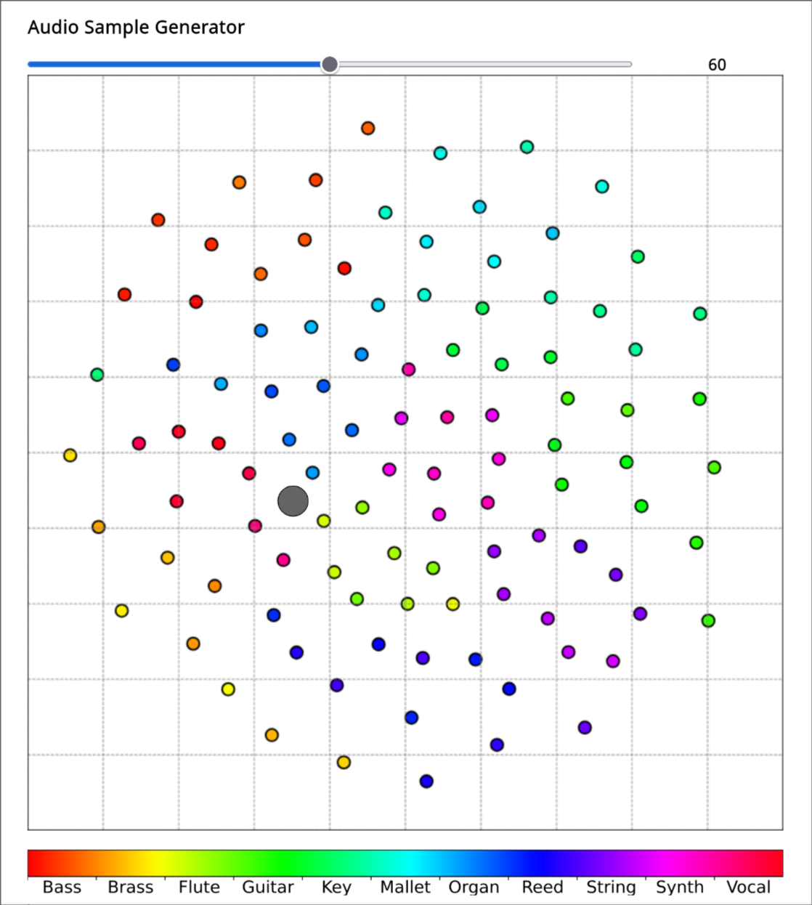
    

        <strong>pGESAM User Interface</strong> 
    

[4] C. Limberg and Z. Zhang, "Mapping the audio landscape for innovative music sample generation," in <em>Proceedings of the 2024 International Conference on Multimedia Retrieval</em>, 2024.

---

## Roadmap

<ol>
<li><strong>Approach</strong>
<ul>
<li>Embedding Extraction</li>
<li>Stage 1: VAE Training</li>
<li>Stage 2: Pitch/Timbre-Conditioned Transformer Training</li>
</ul>
</li>
<li><strong>Evaluation</strong>
<ul>
<li>Dataset</li>
<li>Reconstruction Quality</li>
<li>Pitch Accuracy</li>
<li>Pitch-Timbre Disentanglement</li>
<li>Ablation Study</li>
</ul>
</li>
<li><strong>Conclusion</strong></li>
<li><strong>Interactive Demo</strong></li>
</ol>

Note: In the following sections, we will delve deeper into the pGESAM framework and its components, including the VAE training process and the pitch/timbre-conditioned Transformer training.
Then we will present our experimental results and discuss the implications of our findings.

---

# Approach

---

## Main training paradigm

    

Note: Warum brauchen wir die Embeddings, warum VAE, warum den Transformer? Am Anfang einmal erläutern?

---

## Embedding Extraction

    

---

## Embedding Extraction

    
    

        <ul style="text-align: left; font-size: 0.8em;">
            <li>Use of EnCodec [5] as a feature extractor</li>
            <li>Normally operates as VQ-VAE, but we omit the quantization step to obtain continuous embeddings</li>
            <li>Compression ratio ~ 2.5:1</li>
        </ul>
    

[5] A. Défossez et al., "High fidelity neural audio compression," <em>arXiv preprint arXiv:2210.13438</em>, 2022.

---

## Stage 1: VAE Training

    

---

## VAE Architecture

    

    

        <h4 style="margin: 0.8em;">Encoding</h4>
        <ul>
            <li><strong>Dimension reduction:</strong> Conv layers + linear projection</li>
            <li><strong>Dual Heads:</strong> Pitch classification + timbre regression</li>
        </ul>
    

    

        <h4 style="margin: 0.8em;">Latent structuring</h4>
        <ul>
            <li><strong>Instrument Classifier:</strong> Identify instrument id from latent samples $\tilde{z}$</li>
            <li><strong>Family Classifier:</strong> Identify instrument family from latent samples $\tilde{z}$</li>
        </ul>
    

    

        <h4 style="margin: 0.8em;">Decoding</h4>
        <ul>
            <li><strong>Input:</strong> Concatenate detached pitch $\hat{u}$ + timbre latent samples $\tilde{z}$</li>
            <li><strong>Dimension expansion:</strong> Linear + transposed conv layers</li>
        </ul>
    

---

## Loss Function

**Seven-component loss function for effective pitch-timbre disentanglement:**

\[
\begin{align}
 \mathcal{L}_{\text{VAE}} &= \beta_{\text{rec}} \mathcal{L}_{\text{rec}} + \beta_{\text{KL}} \mathcal{L}_{\text{KL}} + \beta_{\text{reg}} \mathcal{L}_{\text{reg}} + \beta_{\text{nei}} \gamma^{\alpha_{\text{nei}}} \mathcal{L}_{\text{nei}} + \beta_{\text{pitch}} \mathcal{L}_{\text{pitch}} \nonumber\\
&+ \beta_{\text{inst}} \gamma^{\alpha_{\text{inst}}} \mathcal{L}_{\text{inst}} + \beta_{\text{fam}} \left(1 - \gamma\right)^{\alpha_{\text{fam}}}\mathcal{L}_{\text{fam}}\nonumber
\end{align}
\]

**Core VAE Components:**

- $\mathcal{L}_{\text{rec}}$: MSE reconstruction loss
- $\mathcal{L}_{\text{KL}}$: KL divergence regularization
- $\mathcal{L}_{\text{reg}}$: Unit circle constraint

**Disentanglement & Structure:**

- $\mathcal{L}_{\text{nei}}$: Neighbor loss (attractive/repulsive)
- $\mathcal{L}_{\text{pitch}}$: Pitch classification 
(independent of timbre)
- $\mathcal{L}_{\text{inst}}$: Instrument classification
- $\mathcal{L}_{\text{fam}}$: Family classification

**Curriculum Learning Strategy:** $\gamma = \frac{i_{\text{epoch}}}{N_{\text{epoch}}}$ for dynamic loss component weighting

---

<!-- ## Neighbor Loss Details

**Promotes structured clustering through attractive and repulsive forces:**

$$\mathcal{L}_{\text{nei}} = \mathcal{L}_{\text{attractive}} + \mathcal{L}_{\text{repulsive}}$$

**Attractive Component:**

$$\mathcal{L}_{\text{attractive}} = \frac{\sum_{i,j} S_{ij} \cdot d_{ij}^2}{\sum_{i,j} S_{ij} + \epsilon}$$

- Minimizes distances between same instrument samples
- $S_{ij} = \mathbf{1}_{y_i = y_j}$ (same instrument indicator)

**Repulsive Component:**

$$\mathcal{L}_{\text{repulsive}} = \frac{\sum_{i,j} (1-S_{ij}) \cdot \max(0, M - d_{ij})^2}{\sum_{i,j} (1-S_{ij}) + \epsilon}$$

- Enforces margin $M = 0.25$ between different classes
- $d_{ij} = \|\tilde{\mu}_i - \tilde{\mu}_j\|_2$ (Euclidean distance)

**Result:** Compact, well-separated instrument clusters in 2D latent space

!-->

## Stage 2: Transformer Training

    

---

## Transformer Architecture

    

    

        <h4 style="margin: 0.8em;">Encoder</h4>
        <ul>
            <li><strong>Input:</strong> Timbre latent samples $\tilde{z}$ + ground truth pitch $u$</li>
            <li><strong>Processing:</strong> Multi-head self-attention + feed-forward networks</li>
            <li><strong>Output:</strong> Keys and values for decoder cross-attention</li>
        </ul>
    

    

        <h4 style="margin: 0.8em;">Decoder</h4>
        <ul>
            <li><strong>Input:</strong> BOS token + Masked audio embeddings</li>
            <li><strong>Processing:</strong> Masked multi-head self-attention + cross-attention to encoder</li>
            <li><strong>Training:</strong> Autoregressive prediction</li>
        </ul>
    

    

        <h4 style="margin: 0.8em;">Generation</h4>
        <ul>
            <li><strong>Input Encoder:</strong> 2D latent space point + pitch class</li>
            <li><strong>Input Decoder:</strong> BOS token + generated tokens</li>
            <li><strong>Process:</strong> Iterative token-by-token generation</li>
        </ul>
    

---

# Evaluation

---

## Dataset

**NSynth Dataset¹:** Audio dataset containing 305,979 musical notes.

**Dataset Composition:**

- All 11 different instrument families
- **Restricted Pitch Range:** MIDI notes 48-72 (C2 to C4)
- **Restricted Velocity:** Fixed at 100
- **Restricted Number of Instruments:** 10 per family (110 total)
- Original splits: *Training:* 94.52% / *Validation:* 4.14% / *Test:* 1.34%

**Audio Specifications:**

- **Format:** Mono audio files
- **Sample Rate:** 16 kHz → upsampled to 24 kHz
- **Duration:** 4 seconds each
- **Encoding:** EnCodec² 24kHz without quantization

¹NSynth Dataset: <a href="https://magenta.tensorflow.org/datasets/nsynth">https://magenta.tensorflow.org/datasets/nsynth</a> 
²EnCodec Model: <a href="https://huggingface.co/facebook/encodec_24khz">https://huggingface.co/facebook/encodec_24khz</a>

---

## Reconstruction Quality

**Mean Square Error Results:**

| Dataset | VAE | Transformer |
|---------|-----|-------------|
| **Training** | 1.14e-3 | 4.90e-5 |
| **Test** | 1.02e-3 | 1.49e-3 |

**Key Observations:**

- Transformer achieves higher training accuracy

- **Overfitting detected:** Higher test loss vs. VAE

**Qualitative Analysis:**

    

        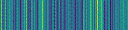
        

            <strong>Original Embedding</strong> 
            Ground truth shows rich structural detail and complexity
        

    

    

        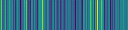
        

            <strong>VAE Generated</strong> 
            Flatter representation with loss of fine-grained structure
        

    

    

        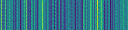
        

            <strong>Transformer Generated</strong> 
            Better preservation of structural complexity
        

    

---

## Pitch Accuracy

**Evaluation Method:** Assess pitch accuracy using the VAE's trained pitch classifier on reconstructed audio embeddings

**Pitch Classification Accuracy (0/1):**

| Dataset | Ground Truth | VAE | Transformer |
|---------|--------------|-----|-------------|
| **Training** | 1.00 | 0.112 | 1.00 |
| **Test** | 0.755 | 0.0691 | 0.996 |

**Key Observations:**

- Ground truth validation confirms classifier reliability
- Transformer achieves near-perfect pitch accuracy
- **VAE struggles:** Only ~11% correct pitch generation in train set

---

## Pitch-Timbre Disentanglement

    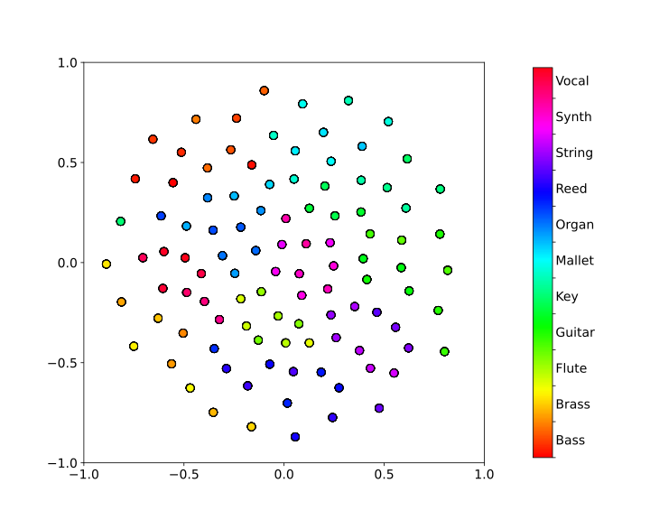
    

    <strong>2D Latent Space Visualization</strong> 
    Predicted timbre latent mean vectors $\tilde{\mu}$

**Key Observations:**

- **Macro Structure:** Clear instrument family clusters
- **Micro Structure:** Individual instruments form distinct clusters
- **Pitch Invariance:** Same instrument, different pitches cluster together
- **Even Distribution:** Clusters spread uniformly in unit circle

<strong style="font-weight: 800">Interpretation:</strong> Successful pitch-timbre disentanglement in intuitive latent space

---

<!-- ## Pitch-Timbre Disentanglement

**Variance Analysis:** Quantitative evaluation of pitch-timbre separation using component-wise variance

**Results Table:**

| Dataset | $V_{\text{inst}}$ [x, y] | $V_{\text{pitch}}$ [x, y] |
|---------|---------------------------|---------------------------|
| **Training** | [1.13e-7, 1.00e-7] | [0.179, 0.179] |
| **Test** | [2.40e-2, 2.83e-2] | [0.136, 0.123] |

**Key Observations:**

- **Training:** Instrument clusters extremely tight (≈10⁻⁷ variance)
- **Theoretical Alignment:** $V_{\text{pitch}}$ ≈ 0.25 matches unit circle expectations
- **Generalization:** Model maintains separation on unseen test data

<strong>Mathematical Expectation:</strong> $V_{\text{inst}} \ll V_{\text{pitch}}$ for effective disentanglement ✓

 -->

## Ablation Study

    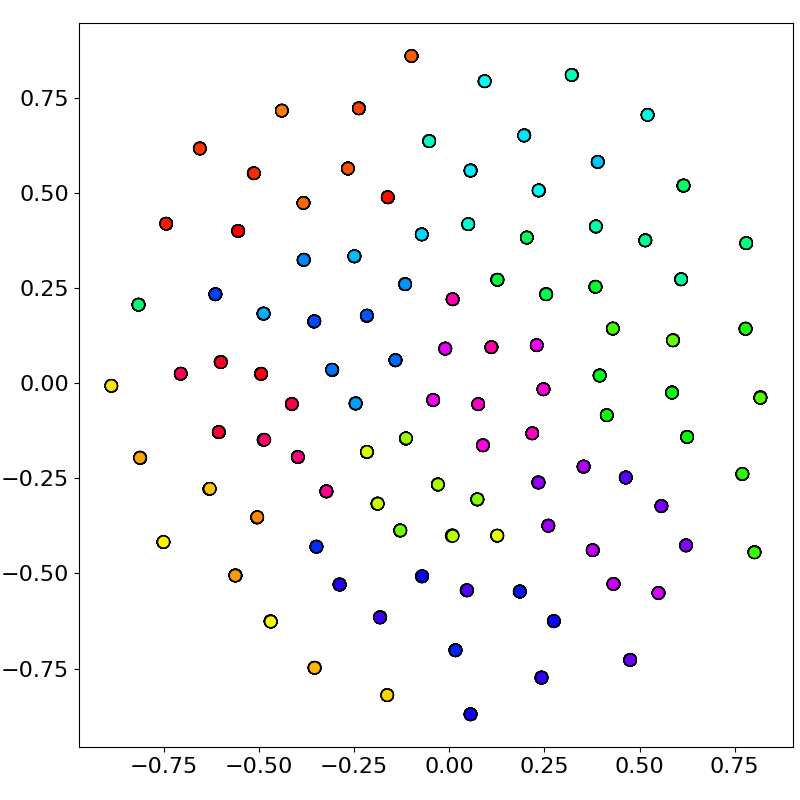
    
All losses

    

        Clear instrument family clusters 
        Even distribution in latent space
    

    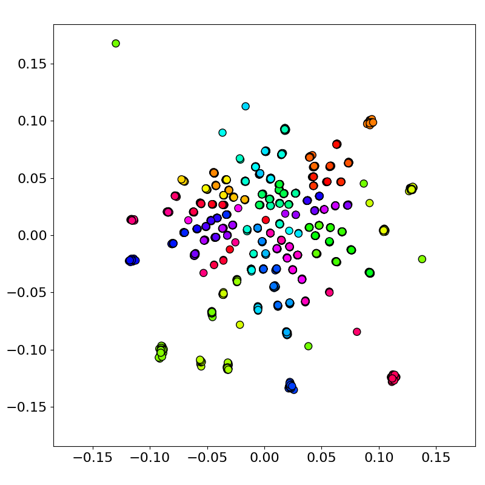
    
No Neighbor Loss

    

        Dense clustering around origin 
        Poor utilization of latent space
    

    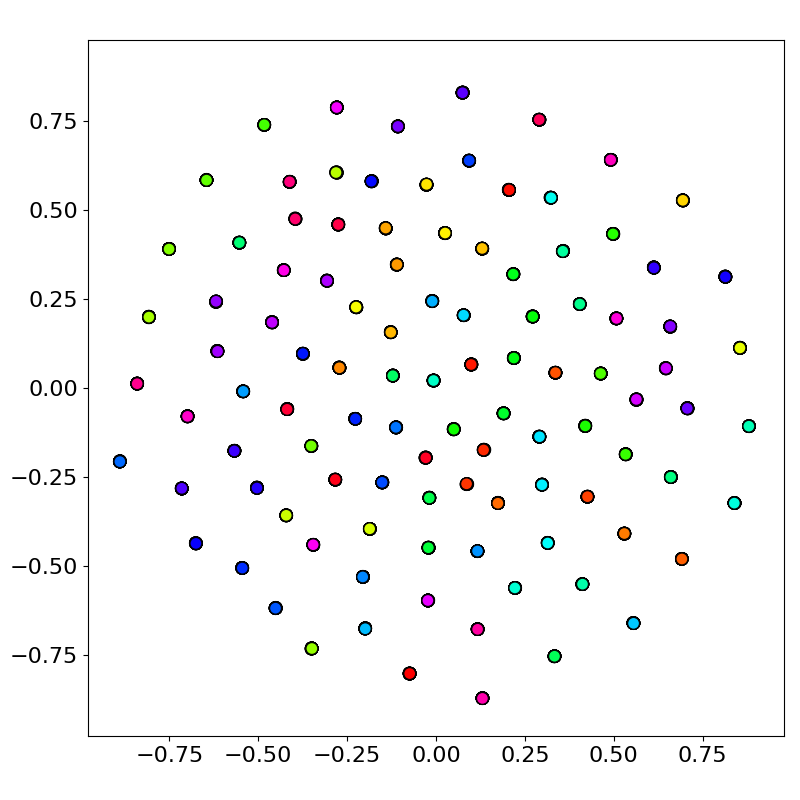
    
No Family Classifier

    

        No macro-clusters of instrument families 
        Scattered family organization
    

    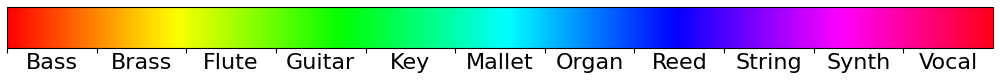

---

# Conclusion

---

## Conclusion

**pGESAM:** Interactive framework for pitch-controlled instrument synthesis from 2D timbre latent space

**Key Contributions:**

- Framework for successful generation of 4 second one-shot samples from 3 data-points (2D timbre, 1D pitch)
- Effective pitch-timbre disentanglement via semi-supervised learning
- Extensive evaluation on NSynth dataset
- Validated 7-component loss function design with use-case specific neighbor loss

---

# Interactive Demo

---

<h1 style="margin: 24px 0 120px 0;">Thank You for Listening!</h1>

<strong>Any Questions?</strong>

    

        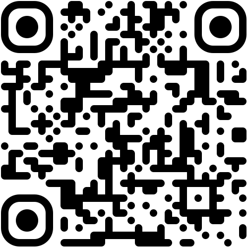
    

    

        Interactive Demo
    

    

        <a>pgesam.faresschulz.com</a>
    

    

        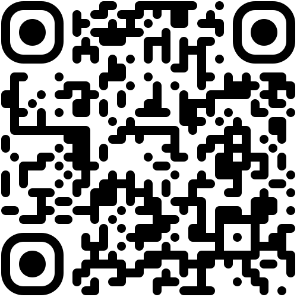
    

    

        Repository
    

    

        <a>github.com/faressc/pgesam</a>
    

Christian Limberg*, Fares Schulz*, Zhe Zhang, Stefan Weinziel 
<em>(*equal contribution)</em>

